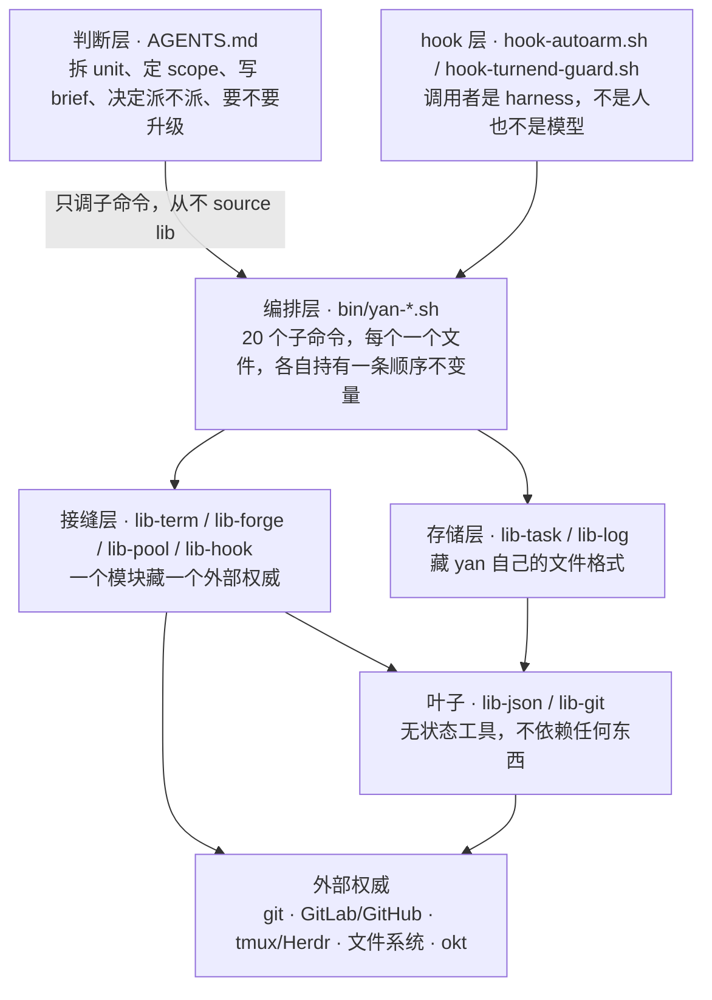

# yan 架构：分层、模块职责、依赖方向

> 状态：草案，2026-08-05。
> 定位：`yan-design.md` 是「为什么」，这份是「代码怎么摆」。
> 决策原文见 [`p0-open-issues.md`](p0-open-issues.md)。

---

## 1. 两条切法

整个分层是两条正交的切法交叉出来的，没有第三条。

**切法一 · 判断 vs 机制**（设计原则 3）
一旦发现在 shell 里写业务语义的 `if`，就是层放错了。判断住在 `AGENTS.md`（模型读），
机制住在 `bin/`（脚本执行）。

**切法二 · 藏外部权威 vs 藏自有格式**
`lib-forge.sh` 藏的是 GitLab 和 GitHub 的差异——厚，deep module。
`lib-log.sh` 藏的是「append 一行」——薄，而且**薄是对的**：它不是在隐藏复杂度，
是在强制一条不变量（永不改写历史行）。把这两种东西叫同一个名字会让人误判该往里塞多少。

---

## 2. 五层



**依赖只往下，从不往上，同层之间不互相调用。**
唯一被允许的同层依赖是 `lib-pool` → `lib-git`（池要做 `worktree add` / `reset` / `clean`），
它是**显式列出的唯一一条例外**，不是先例。

**判断层从不 source 任何 lib。** 模型只能跑 `yan <cmd>`。
这是设计原则 4（user 和 agent 共用同一个入口）在结构上的体现——
user 能敲的和 agent 能调的是同一套东西，不多不少。

---

## 3. 仓库结构

`$YAN_HOME` 就是这个 clone 本身，tracked 的代码和 gitignored 的私有数据同处一棵树
（跟 firstmate 一样）。理由：自举最简单，而且单人用不需要「装一次、开 N 个 home」。

```
$YAN_HOME/
  AGENTS.md                  判断层。唯一常驻上下文
  bin/
    yan                      入口：解析子命令，exec 对应文件
    yan-<cmd>.sh             20 个子命令，一个一个文件（§4.2）
    lib-term.sh              接缝：终端
    lib-forge.sh             接缝：GitLab / GitHub
    lib-pool.sh              接缝：worktree 池
    lib-hook.sh              接缝：conf/hooks/ 外部权威
    lib-task.sh              存储：task.json
    lib-log.sh               存储：log.md
    lib-json.sh              叶子：原子写 + version
    lib-git.sh               叶子：在给定目录里跑 git
    hook-autoarm.sh          Stop hook（asyncRewake）
    hook-turnend-guard.sh    Stop hook（阻塞式）
  .claude/settings.json      注册上面两个 hook + SessionStart nudge
  docs/                      设计文档
  tests/                     每个子命令一个，接缝可替身（§7）

  mem/  tasks/  conf/  repos/    运行时数据，见 yan-design.md §3
```

一条命名约定：**`bin/` 里只有三种前缀**——`yan-*`（子命令）、`lib-*`（库）、`hook-*`（钩子）。
看文件名就知道它在哪一层，谁能调它。

---

## 4. 模块职责

### 4.1 叶子（无状态，不依赖任何东西）

| 模块 | 职责 | 强制的不变量 |
| --- | --- | --- |
| `lib-json.sh` | 读 / 写 JSON | **写一律 `tmp → mv`**；每个文件带 `version` 字段。JSON 是整文件替换语义，中途断掉会毁掉整个文件 |
| `lib-git.sh` | 在给定目录里跑 git：分支、fetch、rebase、merge、push、worktree、`status --porcelain` | 只接受显式的目录参数，**从不依赖 cwd**。永不 `--force` |

`lib-git.sh` 是纯函数式的：给它一个路径和一个动作，它不知道 task、unit、shift 是什么。

### 4.2 存储（藏 yan 自己的格式）

| 模块 | 职责 | 强制的不变量 |
| --- | --- | --- |
| `lib-task.sh` | `task.json` 的读写：units、scope、`branch`/`target`/`mode`/`mr` 四个标量、`history[]`、完成标记 | `history[]` **append-only**，写进去再也不动。当前四个标量和 history 分开，不是「当前 = 数组最后一项」 |
| `lib-log.sh` | 往 `log.md` append 一行 | **append-only，永不改写历史行**。所以永不冲突 |

两个都薄，而且薄是对的。它们存在的理由不是隐藏复杂度，是让「原子写」「append-only」
这两条不变量有一个唯一的执行点，而不是散在二十个调用处。

### 4.3 接缝（一个模块藏一个外部权威）

| 模块 | 藏什么 | 对外接口 | 深度 |
| --- | --- | --- | --- |
| `lib-term.sh` | tmux（0→1）/ Herdr（2→10）的差异 | 七个函数：`term_container_create` `term_agent_start` `term_send` `term_read` `term_agent_alive` `term_agent_close` `term_list` | 中。加 Herdr = 写第二份实现 + 一个 `conf/backend` 开关，**不是插件框架** |
| `lib-forge.sh` | GitLab / GitHub 的参数形状、术语、JSON 形状、鉴权、CI 模型五处差异 | 四个动词：`forge_mr_create` `forge_mr_state` `forge_mr_merge` `forge_ci_state` | **厚**。这是最典型的 deep module |
| `lib-pool.sh` | worktree 池：租约、**热复用**、清理、孤立 commit 守卫 | `pool_get` `pool_return` `pool_status` | 厚。见 `yan-design.md` §7。契约：还树用 `clean -fd`，**永不带 `-x`**——保住 `node_modules` 是池存在的唯一理由 |
| `lib-hook.sh` | `conf/hooks/` 的调用协议：stdin 喂 JSON、stdout 收一行、非零退出即失败 | `hook_call <name> <json>` | 薄。但它是**唯一**允许执行 `conf/` 下面东西的地方 |

三条接缝层的硬规则：

1. **返回值必须是 yan 的封闭集合，不是外部权威的原话。**
   `forge_mr_state` 只回 `merged | closed | open | unknown`——正好是 §6.4 判定 `end`
   需要的四种情况，一一对应。`term_agent_alive` 只回活 / 死 / 不确定。
2. **不做决定。** 接缝报告事实，编排层决定怎么办。
   `forge_ci_state` 回 `red` 是事实；「红了要派新 shift 修」是编排层的事。
3. **不写 `$YAN_HOME` 的记账层。** 接缝只碰它自己那个外部权威。

**要防的是接缝退化成 shallow module**：每个函数一行透传，返回值原封不动漏出去，
调用方还是得知道自己在跟谁说话——那就是 pass-through method，是 deep 的反面。
避免它只有一条：**接口用 yan 自己的词汇定义，不是两个实现的并集。**

---

## 5. 编排层：20 个子命令

一个子命令一个文件，像 git。不写一个包罗万象的巨型脚本——每个子命令要独立可读、可单独测。

判断一个子命令属于「原子」还是「编排」，看它**有没有持有一条顺序不变量**——
如果打乱它内部的步骤顺序会出错，它就是编排。

### 5.1 原子命令（一个动作，无编排）

| 命令 | 职责 | 为什么是脚本而不是让 agent 自己做 |
| --- | --- | --- |
| `yan report <state> "<note>"` | append `run/status` + touch `run/signal` | **别指望 agent 记得做两步。** 包成一个命令还能顺带校验 state 只属于那五个词、加时间戳、原子写。这是 shift 唯一需要调的 yan 命令（外加 `scope-check`） |
| `yan send <sid> "<line>"` | 单行消息发给 shift | 文字和 Enter 分开发，文字只打一次、只重试 Enter |
| `yan drain` | 读 wake 文件并清空 | 模型被唤醒后的第一件事 |
| `yan scope-check <sid>` | `git diff --name-only` + 前缀匹配 | **只报告，不拦。** 越界要显式扩 scope，不是禁止 |
| `yan tree get\|return\|status` | 池的用户入口 | user 和 agent 共用同一个入口 |
| `yan ls` | 扫 `tasks/*/task.json` 渲染队列 | 没有 backlog 文件，队列是扫出来的视图 |
| `yan open <id>` | 打开 task 目录 / artifacts | artifacts 的主要读者是 user |
| `yan repo-add <url>` | 注册 repo，clone 到 `repos/` | `repos.json` 的唯一写入口 |

### 5.2 编排命令（各自持有一条顺序不变量）

| 命令 | 步骤 | 它持有的不变量 |
| --- | --- | --- |
| `yan shift new` | sync 集成分支 → 租树（含切子分支）→ 写 brief → 起终端 → 注入 `YAN_TASK_DIR` | **spawn 必须断言 sub-agent 的 cwd 不等于主 clone 路径，否则拒绝启动** |
| `yan shift done` | 校验 MR 已合 → 写 `outcome` → 写 log → `rm -rf run/` → **还树 → 删远端子分支** | **还树必须排在删分支之前。** squash 合的话，先删分支会让「有副本」判据变成假 |
| `yan sync` | 租树 → fetch → rebase/merge target → push → 还树 | **有冲突就立刻退出交给 shift**，不在脚本里解冲突。时机固定：每次开新 shift 之前 |
| `yan unit add` | `branch-name` hook → 分支存在则 checkout、不存在则从 base 切 → 写 `task.json` | **hook 非零退出就停下报错，绝不 fallback 到内置默认** |
| `yan unit set --branch` | 查 forge 判定 `end` → 打包旧的进 `history[]`（带 `at`）→ 覆盖当前字段 → log 一行 | **换赛道是一个原子操作。** 判定结果必须写进 history，写完就不再查 forge |
| `yan mr` | 开对外 MR → 写 `unit.mr` | 开 MR 可逆，所以自主；合不可逆，所以要 user 明说 |
| `yan land` | 按 `needs` 拓扑排序 → 合 | **必须 user 明说。** 这是唯一影响 target 的动作 |
| `yan task new` | 建 `tasks/<id>/` → 写 brief | — |
| `yan start <id>` | 建 task 终端容器 → 在里面起 yan | 一个 task 一个容器；容器生命周期 = user 手动开关 |
| `yan state <sid>` | 从 `run/meta.json` + 终端 + git + forge 现场推导 | **`run/status` 的每一行是事件，不是当前状态。** 当前状态只能推导，不能读最后一行 |
| `yan session-start` | 全量 reconcile：扫 `tasks/` → 查终端 → 查池 → 查 forge → 出摘要 | **重启是非事件。** 权威是 durable state 加实时清点，不是对话记忆 |
| `yan wait` | 盯三个 source，有事写 wake 文件 + 打印 reason + exit 0，无事静默 exit 非 0 | **纯观察者，不持有任何状态。** 超时、被杀、随 hook 进程树死掉都不丢东西 |

`yan wait` 是最容易写胖的一个。它的 triage 就是那三个 source（`run/signal`、
`term_agent_alive`、pane 内容 hash 长时间不变），长在它里面，**不单独起一层**。

---

## 6. hook 层

调用者是 harness，不是 user 也不是模型。所以它有一条别人没有的约束：**不能依赖模型记得做任何事**。

| 文件 | 类型 | 职责 |
| --- | --- | --- |
| `hook-autoarm.sh` | Stop，`asyncRewake: true`，长 timeout | 拿单飞锁 → 在自己前台跑 `yan wait` → 翻译成 exit 0/2 |
| `hook-turnend-guard.sh` | Stop，阻塞式 | 监督不健康就拦住结束 turn，预算 3 次后 fail open **并大声报警** |

两条来自 firstmate 实伤的硬规则：

- **guard 不读 stdin，不用 `stop_hook_active`。** 它要的信息（有没有活、watcher 健不健康、
  拦过几次、哪个 task）全在文件系统和 `YAN_TASK` 环境变量里。自己数，计数写
  `run/guard-failures`，watcher 恢复健康时清零。
- **watcher 就跑在 hook 的前台，绝不用 shell `&`。** 这样 harness 拥有进程组，
  超时或会话销毁时两者一起被杀。timeout 必须设长，否则 hook 被杀 watcher 就跟着死。

---

## 7. 可测性

分层的实际回报在这儿：**接缝层是唯一碰外部世界的东西**，所以测一个子命令
= 把接缝换成替身。

```
tests/
  stub/lib-term.sh     记录调用，不起终端
  stub/lib-forge.sh    回放固定的 MR 状态序列
  stub/lib-pool.sh     发一个临时目录
  yan-shift-done.test.sh
  ...
```

子命令统一用 `. "${YAN_LIB:-$YAN_HOME/bin}/lib-forge.sh"` 这种形式 source，
测试把 `YAN_LIB` 指到 `tests/stub/` 就完成替换——不需要任何注入框架。

值得优先钉住的四条：

1. `yan shift done` 在 squash 场景下**先还树后删分支**
2. `yan shift new` 的 cwd 断言真的会拒绝启动
3. `yan sync` 遇到冲突真的退出，而不是留下半个 rebase
4. **`pool_return` 之后，一个 gitignored 的目录（`node_modules` 替身）仍然在。**
   这条是防回归的：某天有人为了「清干净一点」给 `clean` 加上 `-x`，
   池就静默退化成「每次冷装」，而且没有任何报错——只是突然变慢。
   一个 flag 的事故，值得一个用例守着

---

## 8. 还没定的

1. **task id 格式**：`t042` 式序号还是语义 slug。它会进分支名（`yan/<task>-<unit>-<sid>`），
   所以短的有实际好处。
2. **`$YAN_HOME` 要不要 git 版本化**：`mem/user.md` 和 `learnings/` 有提交历史挺有价值，
   但 `tasks/` 一起进去会很吵。倾向 `mem/` 进、`tasks/` 不进。
3. **`lib-pool` 的池根目录**：`~/.yan-trees/<repo>-<hash>/N/<repo>` 是当前写法，
   要不要做成可配置。
