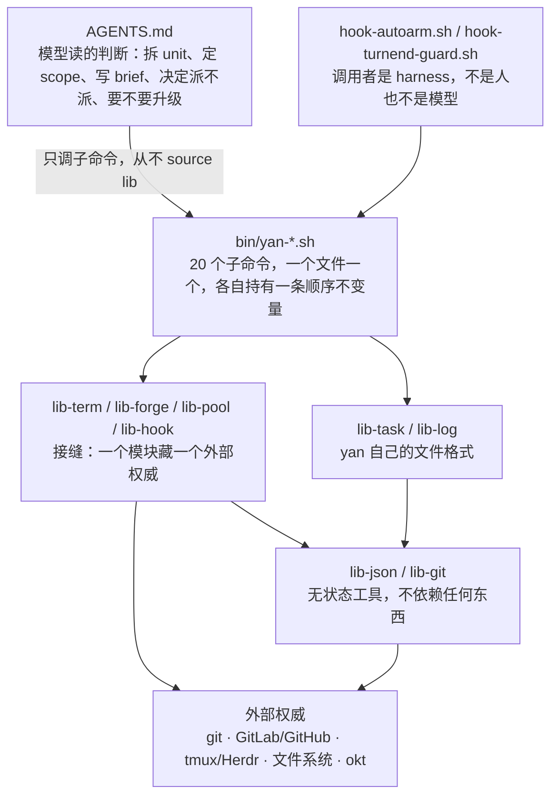

# yan 架构：代码怎么摆

> 状态：草案，2026-08-05。
> 定位：[`INDEX.md`](INDEX.md) 说「为什么」，这份说「代码放在哪、谁能调谁、怎么测」。
> 决策记录见 [`decisions.md`](../decisions.md)。
> 本文里裸写的 `§x.y` 指本文；指设计文档时一律写成 `design §x.y`。

---

## 1. 两条切法

整个结构是两条正交的切法交叉出来的，没有第三条。

**切法一 · 判断 vs 机制。** 判断写在 `AGENTS.md` 里给模型读，机制写在 `bin/` 里给脚本跑。
分界线是设计原则 3（[design §0](INDEX.md#0-这是什么)）：一旦发现在 shell 里写业务语义的 `if`，就是层放错了。

**切法二 · 藏外部权威 vs 藏自有格式。** `lib-forge.sh` 藏的是 GitLab 和 GitHub 的差异，所以它厚；
`lib-log.sh` 藏的只是「append 一行」，所以它薄。而薄在这里是对的——它不是在隐藏复杂度，
是在强制一条不变量（永不改写历史行）。如果把这两种东西叫同一个名字，就会让人误判该往里塞多少。

---

## 2. 谁能调谁

**依赖只往下，从不往上，同层之间不互相调用。**



唯一被允许的同层依赖是 `lib-pool` → `lib-git`（池要做 `worktree add` / `reset` / `clean`）。
它是显式列出的唯一一条例外，不是先例。

**模型从不 source 任何 lib，只能跑 `yan <cmd>`。**
这是设计原则 4（user 和 agent 共用同一个入口）在结构上的体现——
user 能敲的和 agent 能调的是同一套东西，不多不少。

---

## 3. 仓库结构

`$YAN_HOME` 就是这个 clone 本身，tracked 的代码和 gitignored 的私有数据同处一棵树
（跟 firstmate 一样）。理由：自举最简单，而且单人用不需要「装一次、开 N 个 home」。

```
$YAN_HOME/
  AGENTS.md                  模型读的判断。唯一常驻上下文
  bin/
    yan                      入口：解析子命令，exec 对应文件
    yan-<cmd>.sh             20 个子命令，一个文件一个（§5）
    lib-term.sh              接缝：终端
    lib-forge.sh             接缝：GitLab / GitHub
    lib-pool.sh              接缝：worktree 池
    lib-hook.sh              接缝：conf/hooks/ 外部权威
    lib-task.sh              存储：task.json
    lib-log.sh               存储：log.md
    lib-json.sh              工具：原子写 + version
    lib-git.sh               工具：在给定目录里跑 git
    hook-autoarm.sh          Stop hook（asyncRewake）
    hook-turnend-guard.sh    Stop hook（阻塞式）
  .claude/settings.json      注册上面两个 hook + SessionStart nudge
  docs/                      设计文档
  tests/                     每个子命令一个，接缝可替身（§7）

  mem/  tasks/  conf/  repos/    运行时数据，见 design §3
```

一条命名约定：**`bin/` 里只有三种前缀**——`yan-*`（子命令）、`lib-*`（库）、`hook-*`（钩子）。
看文件名就知道它在哪一层、谁能调它。

---

## 4. 模块职责

### 4.1 工具：`lib-json` / `lib-git`

这两个模块都无状态，也不依赖任何东西。其中 `lib-git.sh` 是纯函数式的：给它一个路径和一个动作就行，
它并不知道 task、unit、shift 是什么。

| 模块 | 职责 | 强制的不变量 |
| --- | --- | --- |
| `lib-json.sh` | 读 / 写 JSON | 写一律 `tmp → mv`；每个文件带 `version` 字段。两条的理由见 [design §2](INDEX.md#2-三条判据) |
| `lib-git.sh` | 在给定目录里跑 git：分支、fetch、rebase、merge、push、worktree、`status --porcelain` | 只接受显式的目录参数，**从不依赖 cwd**。永不 `--force` |

### 4.2 存储：`lib-task` / `lib-log`

两个都薄，而且薄是对的。它们存在的理由不是隐藏复杂度，是让「原子写」「append-only」
这两条不变量有一个唯一的执行点，而不是散在二十个调用处。

| 模块 | 职责 | 强制的不变量 |
| --- | --- | --- |
| `lib-task.sh` | `task.json` 的读写：units、scope、`branch`/`target`/`mode`/`mr` 四个标量、`history[]`、完成标记 | `history[]` **append-only**。当前四个标量和 history 分开，不是「当前 = 数组最后一项」（[design §6.4](branching.md#64-unit-的结构当前是标量历史是-append-only)） |
| `lib-log.sh` | 往 `log.md` append 一行 | **append-only，永不改写历史行**。所以永不冲突 |

### 4.3 接缝：一个模块藏一个外部权威

| 模块 | 藏什么 | 对外接口 | 深度 |
| --- | --- | --- | --- |
| `lib-term.sh` | tmux 和 Herdr 的差异 | 七个函数 | 中。这一层藏了什么、七个函数分别干什么、加 Herdr 要做什么，都见 [design §5.7](agents.md#57-终端拓扑) |
| `lib-forge.sh` | GitLab 和 GitHub 的五处差异 | 四个动词 | **厚**，是这里最典型的 deep module。哪五处差异、四个动词各回什么，见 [design §8.4](delivery.md#84-forge-层lib-forgesh) |
| `lib-pool.sh` | worktree 池 | `pool_get` `pool_return` `pool_status` | 厚。租约、热复用契约、还树判据、孤立 commit 守卫都见 [design §7](worktree.md#7-worktree) |
| `lib-hook.sh` | `conf/hooks/` 的调用协议（[design §10](boundaries.md#10-外部权威接缝okt-等)） | `hook_call <name> <json>` | 薄。但它是**唯一**允许执行 `conf/` 下面东西的地方 |

三条硬规则：

1. **返回值必须是 yan 的封闭集合，不是外部权威的原话。**
   `forge_mr_state` 只回 `merged | closed | open | unknown`（这四个值怎么来的见 [design §8.4](delivery.md#84-forge-层lib-forgesh)），
   `term_agent_alive` 只回活 / 死 / 不确定。
2. **不做决定。** 接缝报告事实，子命令决定怎么办。
   `forge_ci_state` 回 `red` 是事实；「红了要派新 shift 修」是子命令的事。
3. **不写 `$YAN_HOME` 的记账层。** 接缝只碰它自己那个外部权威。

四个接缝共同的失败模式是退化成 shallow module——每个函数一行透传，返回值原封不动漏出去，
调用方还是得知道自己在跟谁说话。完整论证和唯一的避法见 [design §8.4](delivery.md#84-forge-层lib-forgesh)。

---

## 5. 20 个子命令

每个子命令单独一个文件，就像 git 那样。不要写一个包罗万象的巨型脚本，因为每个子命令都要能独立读懂、也能单独测。

判断一个子命令属于「原子」还是「编排」，看它**有没有持有一条顺序不变量**——
如果打乱它内部的步骤顺序会出错，它就是编排。

### 5.1 原子命令（一个动作，无编排）

为什么它们必须是脚本而不是让 agent 自己做，见 [design §5.4](agents.md#54-通信)。

| 命令 | 职责 |
| --- | --- |
| `yan report <state> "<note>"` | append `run/status` + touch `run/signal`。只接受那五个 state |
| `yan send <sid> "<line>"` | 单行消息发给 shift。文字和 Enter 分开发 |
| `yan drain` | 读 wake 文件并清空。模型被唤醒后的第一件事 |
| `yan scope-check <sid>` | `git diff --name-only` + 前缀匹配。**只报告，不拦**（[design §8.3](delivery.md#83-强制手段)） |
| `yan tree get\|return\|status` | 池的用户入口 |
| `yan ls` | 扫 `tasks/*/task.json` 渲染队列 |
| `yan open <id>` | 打开 task 目录 / artifacts |
| `yan repo-add <url>` | 注册 repo，clone 到 `repos/`。`repos.json` 的唯一写入口 |

### 5.2 编排命令（各自持有一条顺序不变量）

| 命令 | 步骤 | 它持有的不变量 |
| --- | --- | --- |
| `yan shift new` | sync 集成分支 → 租树（含切子分支）→ 写 brief → 起终端 → 注入 `YAN_TASK_DIR` | **spawn 必须断言 sub-agent 的 cwd 不等于主 clone 路径，否则拒绝启动**（[design §7](worktree.md#7-worktree)） |
| `yan shift done` | 校验 MR 已合 → 写 `outcome` → 写 log → `rm -rf run/` → 还树 → 删远端子分支 | **还树必须排在删分支之前**（[design §7](worktree.md#7-worktree)） |
| `yan sync` | 租树 → fetch → rebase/merge target → push → 还树 | **有冲突就立刻退出交给 shift**，不在脚本里解冲突。时机固定：每次开新 shift 之前（[design §6.3](branching.md#63-集成分支怎么变)） |
| `yan unit add` | `branch-name` hook → 分支存在则 checkout、不存在则从 base 切 → 写 `task.json` | **hook 非零退出就停下报错，绝不 fallback 到内置默认**（[design §10](boundaries.md#10-外部权威接缝okt-等)） |
| `yan unit set --branch` | 查 forge 判定 `end` → 打包旧的进 `history[]`（带 `at`）→ 覆盖当前字段 → log 一行 | **换赛道是一个原子操作**，判定结果写进 history 之后就不再查 forge（[design §6.4](branching.md#64-unit-的结构当前是标量历史是-append-only)） |
| `yan mr` | 开对外 MR → 写 `unit.mr` | 授权见 [design §9.2](boundaries.md#92-外部副作用真正需要边界的部分) |
| `yan land` | 按 `needs` 拓扑排序 → 合 | **必须 user 明说**（[design §9.2](boundaries.md#92-外部副作用真正需要边界的部分)） |
| `yan task new` | 建 `tasks/<id>/` → 写 brief | — |
| `yan start <id>` | 建 task 终端容器 → 在里面起 yan | 一个 task 一个容器，容器生命周期 = user 手动开关（[design §5.7](agents.md#57-终端拓扑)） |
| `yan state <sid>` | 从 `run/meta.json` + 终端 + git + forge 现场推导 | **当前状态只能推导，不能读 `run/status` 的最后一行**（[design §5.4](agents.md#54-通信)） |
| `yan session-start` | 全量 reconcile：扫 `tasks/` → 查终端 → 查池 → 查 forge → 出摘要 | **重启是非事件**（[design §5.1](agents.md#51-寿命分层决定存储策略)） |
| `yan wait` | 盯三个 source，有事写 wake 文件 + 打印 reason + exit 0，无事静默 exit 非 0 | **纯观察者，不持有任何状态**（[design §5.5](supervision.md#55-监督)） |

`yan wait` 是最容易写胖的一个：那三个 source 就长在它里面，不单独起一层（[design §5.5](supervision.md#55-监督)）。

---

## 6. 两个 hook

调用者是 harness，不是 user 也不是模型。所以它们有一条别人没有的约束：**不能依赖模型记得做任何事**。

| 文件 | 怎么注册 |
| --- | --- |
| `hook-autoarm.sh` | Stop，`asyncRewake: true`，长 timeout |
| `hook-turnend-guard.sh` | Stop，阻塞式 |

两个 hook 各自干什么、为什么是两个而不是一个，都在 [design §5.5](supervision.md#55-监督) 里。
这里只补两条落到代码上必须钉死的规则，它们的理由同样在那一节（两条都是 firstmate 踩过的实伤）：

- **guard 不读 stdin，也不用 `stop_hook_active`。** 它自己数，计数写 `run/guard-failures`，
  watcher 恢复健康时清零。
- **watcher 就跑在 hook 的前台，绝不用 shell `&`。** timeout 必须设长。

---

## 7. 可测性

分层的实际回报在这儿：**接缝是唯一碰外部世界的东西**，所以测一个子命令 = 把接缝换成替身。

```
tests/
  run.sh                 跑全部；--fast 只跑 stub 级
  stub/lib-term.sh       记录调用，不起终端
  stub/lib-forge.sh      回放固定的 MR 状态序列
  stub/lib-pool.sh       发一个临时目录
  yan-shift-done.test.sh
  ...
```

子命令统一用 `. "${YAN_LIB:-$YAN_HOME/bin}/lib-forge.sh"` 这种形式 source，
测试把 `YAN_LIB` 指到 `tests/stub/` 就完成替换——**不需要任何注入框架**。
这个形状在 P0 就定死，后面所有 task 都沿用它。

哪些用例必须写、什么时候跑，见 [`implementation-plan.md` §2](../implementation-plan.md#2-task-清单) 和 [§3](../implementation-plan.md#3-测试策略)。
其中四条顺序回归用例值得单独记住：它们守的都是「错了不报错，只是悄悄坏掉」的东西。
