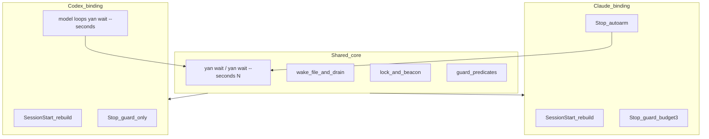
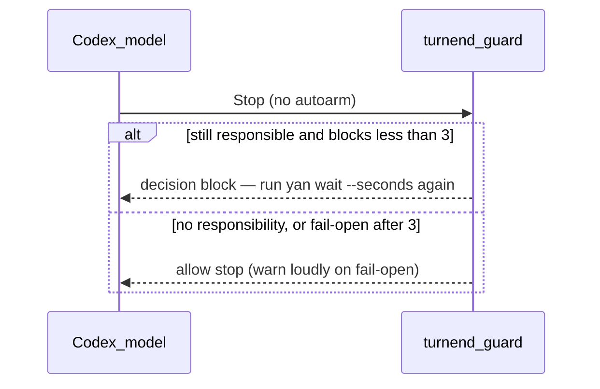

# 5.5 Supervision

Supervision answers: when a `shift` finishes or gets stuck, who wakes `yan` up?

The design splits into a **shared core** (`yan wait`, wake file, lock, beacon, drain, guard predicates) plus a thin **harness binding** for Claude Code and for Codex. It does not add a separate triage layer on top of the three wait sources. It does not support a third harness for `yan`, and it does not use a detached/`&` watcher as the Codex path.



Quick glossary (easy to confuse):

| Concept | What it is | What it is not |
| --- | --- | --- |
| SessionStart | hook nudges **`yan session-start`** (rebuild in seconds) | not a 180s `yan wait` |
| checkpoint | Codex **actively** calling `yan wait --seconds N` | not a separate command; not part of SessionStart |
| long coverage | many checkpoint slices in a row (wall clock can be long) | not the guard's budget of 3 |
| guard budget 3 | at most three blocked attempts to end the turn, then fail open | not "poll the shift three more times" |
| beacon | **`yan wait` writes** it; **guard / health checks read** it | not how a shift's death is detected |
| shift event | `yan report` → `status` + `signal` | not an arbitrary progress file |
| shift died | **`term_agent_alive`** | not the beacon |
| shift stuck | **pane content hash unchanged for a long time** | not the beacon |

---

## Shared core

### `yan wait`

`yan wait` is the watcher. It is a pure observer and holds no durable state of its own: a timeout, a kill, or dying with its process tree loses nothing — the `shift` is still in its own terminal and the facts live in files.

Two shapes, one command:

| Shape | Who starts it | Duration |
| --- | --- | --- |
| `yan wait` (long) | Claude Stop autoarm, in the hook's foreground | minutes to hours |
| `yan wait --seconds N` | Codex model, as a foreground tool call (default `N=180`, overridable via `YAN_CODEX_CHECKPOINT`) | hard stop at N; return control to the model |

Same three sources in both shapes. On an actionable event: write the wake file, print a reason, exit 0. On a quiet end with `--seconds`: exit with the agreed non-zero code (e.g. 124) so the model knows to drain and, if still responsible, start another slice. Without `--seconds`, a quiet end is a silent non-zero exit for the Claude hook path (no model wake).

### The sources

| Source | What it catches | Cost |
| --- | --- | --- |
| `run/signal` | the `shift` reporting on its own via `yan report` | a file existence check |
| `term_agent_alive` | the agent died, which it cannot report itself | one terminal query |
| the pane's content hash not changing for a long time | stuck, waiting on a dialog, or forgot to report | `term_read` plus `md5` |

The third earns its place because forgetting to report is the most common agent failure. `yan` does not need a fourth source that polls pull requests: a `shift` does not wait for CI before clocking out ([§5.3](agents.md#53-the-life-of-a-shift)).

### Infrastructure

| | Why it exists |
| --- | --- |
| single-flight lock | under Claude, every Stop can fire autoarm; without a lock you get several watchers |
| wake file | the reason must survive from "wait exited" to "the model's next turn" |
| beacon | `yan wait` touches a timestamp each loop; a live pid alone does not prove the watcher is looping |

"Watcher healthy" (used on the Claude path) means all of: the lock exists and its pid is alive; the identity matches; the beacon is fresh (default 300s). Both directions matter: a stale beacon blocks even when a watcher pid is live; a fresh leftover beacon blocks when the lock is missing, dead, or identity-mismatched.

The beacon is attendance for the **watcher**. Other processes read it. It is not how shift death is detected.

### SessionStart rebuild

A restart is a non-event because durable state plus live inventory are authoritative ([§5.1](agents.md#51-lifetime-tiers)), not because of any hook. SessionStart only removes the need for the model to remember: inject "run `yan session-start` first". That rebuild is seconds-scale. It does **not** run `yan wait --seconds`.

### `yan drain`

After a wake (Claude rewake or Codex tool return with a reason), the model reads and clears the wake file with `yan drain` before acting.

### Interrupting wakes

When a shift notification arrives while `user` is mid-conversation with `yan`:

> Handle the notification first, then return to what `user` was talking about.

Per-task `yan` keeps those interruptions on-topic.

### Known gap (both harnesses)

After every `shift` has clocked out and outbound CI is running, none of the three sources has anything to wait for. The first version ends the turn without waiting for CI; the next SessionStart asks the forge. A fourth source that polls CI is deferred.

---

## Claude binding

Registered in `.claude/settings.json`.

| Hook | Type | What it does |
| --- | --- | --- |
| SessionStart | nudge | run `yan session-start` first |
| Stop (autoarm) | `asyncRewake: true`, long timeout | take the single-flight lock → run long `yan wait` in the hook foreground → exit 0 quiet or exit 2 to rewake |
| Stop (turnend guard) | blocking | if there is work to supervise and the watcher is not healthy, block; after three failures, fail open |

autoarm starts supervision. The guard checks that supervision actually started. The model never calls `yan wait` on this path — so "the model forgot to start supervision" is not a possible failure for Claude.

### Claude Stop flow

```
user speaks → yan finishes → about to end the turn
   ↓  both Stop hooks fire concurrently

   guard (blocking)                  autoarm (asyncRewake, long timeout)
   ─────────────────             ──────────────────────────────────
   is there work to supervise?        is there work to supervise?
     no → let it through                no → exit
   is the watcher healthy?             take the single-flight lock
     yes → reset the count,            run yan wait in its own foreground
           let it through                ↓ blocks for minutes to hours
   wait 800ms: was the lock taken?    the watcher sees s1 finish
     yes → let it through                ↓ write the wake file
   neither → count + 1                 exit 2 + a banner on stderr
     ≤3 → exit 2, block                 ↓
     >3 → let it through + warn       yan is woken → yan drain
```

The 800 ms wait is so the guard does not false-alarm while autoarm is still claiming the lock.

**Guard reason on Claude:** there is still supervision responsibility **and** nobody is on duty (watcher unhealthy). Ending the turn while shifts are live is fine when autoarm is holding `yan wait`.

autoarm uses a long timeout (eight hours is a workable default). The watcher runs in the hook foreground, never `&`, so the harness owns the process group.

### Claude guard details

**One:** the guard's value shows up when autoarm never ran at all (broken settings, skipped hook). Only a second hook can detect that.

**Two:** do not use Claude's `stop_hook_active` as a one-shot unblock. Claude sets it true after asyncRewake continuations too, which re-opens a blind window: the turn that needs a new watcher armed already looks "already continued", so a one-shot guard lets it through. The guard keeps its own count in `run/guard-failures`, reset when the watcher is healthy again. It does not need to read stdin.

The budget is 3 (under Claude's own ~8-block override). After that, fail open with a loud warning: automatic supervision is broken; use `yan ls <id>` or restart.

**Three:** fail open on purpose rather than wedge the session forever.

---

## Codex binding

Registered in `.codex/hooks.json` (and/or the documented `config.toml` hooks fragment).

| Hook | What it does |
| --- | --- |
| SessionStart | same rebuild nudge / context injection for `yan session-start` |
| Stop (turnend guard only) | block ending the turn while supervision responsibility remains; no autoarm |

There is **no** Stop autoarm on Codex. As of the public Codex hooks docs (checked 2026-08-09): *The `async` option is parsed, but asynchronous command hooks aren't supported yet.* Stop can synchronously return `decision: "block"` for an immediate continuation; it cannot hold a multi-hour watcher and rewake later the way Claude's `asyncRewake` does. Once a turn has truly ended, nothing wakes the model until `user` speaks or SessionStart runs again.

### How long coverage works on Codex

The model **actively** loops:

1. When this session still has shifts to supervise, run `yan wait --seconds ${YAN_CODEX_CHECKPOINT:-180}` as a foreground tool.
2. On an event: `yan drain`, handle, start the next `--seconds` slice.
3. On quiet timeout: drain anyway, handle any newly visible user message, start the next slice.
4. Never use shell `&` or Codex background tasks for watcher supervision.
5. Do not use long unbounded `yan wait` as Codex's normal path.

"Cannot reason while a foreground tool call is running" is why the slice must be bounded: returning control is what makes the next wake possible. Wall-clock coverage can still be long if the model keeps looping. That loop is orthogonal to the guard's budget of 3.

```mermaid
sequenceDiagram
  participant Codex as Codex_model
  participant Wait as yan_wait_seconds
  participant Shift as shift_agent
  participant Disk as signal_wake_lock_beacon

  Codex->>Wait: yan wait --seconds 180
  loop while still responsible
    Wait->>Disk: poll three sources; touch beacon
    Shift-->>Disk: report or die or stuck
    alt event in slice
      Wait->>Disk: write wake
      Wait-->>Codex: exit 0 + reason
      Codex->>Disk: yan drain
      Codex->>Wait: next --seconds
    else quiet timeout
      Wait-->>Codex: timed out
      Codex->>Disk: drain
      Codex->>Wait: next --seconds
    end
  end
```

### Codex Stop / guard



**Guard reason on Codex:** there is still supervision responsibility (live shifts that need watching) and the model is trying to end the turn. That is the primary predicate — not Claude's "autoarm lock + fresh beacon", because between slices there is no long-lived wait process. Beacon/lock may still help detect odd states; they are not the main "may I clock out?" test.

Codex may use `stop_hook_active` one-shot behaviour where it matches Codex's continuation model. The shared fail-open budget of 3 still applies so a broken loop cannot wedge the session forever.

A diligent Codex rarely meets the guard. A lazy one gets blocked up to three times ("run another `yan wait --seconds`"), then fail-open, after which coverage waits for the next user turn or SessionStart.

Interactive Codex TUI may not always fire project SessionStart hooks. Binding must also put the rebuild + checkpoint protocol into `AGENTS.md` / injected instructions so a missed hook is not silent blindness.

Optional for a later thin cut: a PreToolUse seatbelt that denies backgrounded / piped long `yan wait` anti-patterns on Codex.

### Accepted Codex cost

- Idle coverage costs a tool round trip about every N seconds.
- During a foreground `--seconds` call the model cannot reason in parallel; interruptibility is worse than Claude asyncRewake.
- Continuity depends partly on the model keeping the protocol; fail-open then needs `user` or a restart.
- Codex is not zero-cost parity with Claude; it is the supported company path.

---

## What was cut

A separate triage layer above the wake pipeline, primary-scope detection for a second-level agent tree, and adapters for many harnesses. `yan` keeps two bindings only (Claude and Codex). Triage stays inside `yan wait`'s three sources.
