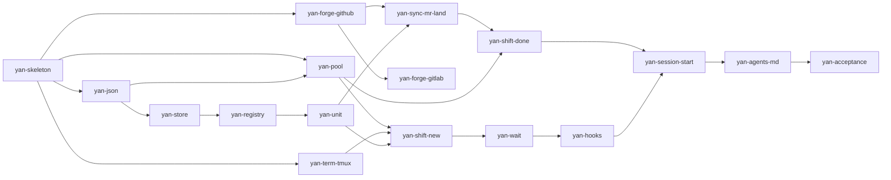

# 实现计划：七个阶段，17 个 task

> 状态：草案，2026-08-05。
> 依据：[`yan-design.md`](yan-design.md) 的决策，[`architecture.md`](architecture.md) 的分层。
> 规模基准：~2,710 行，~30 个文件。

---

## 0. 切分原则

**不按层自底向上做。** 自底向上的问题是到最后一刻之前什么都不能用，没有任何反馈，
而且等你发现监督那层跑不通的时候已经写完了 2,000 行。

改成：**先撑起最小骨架（很小），然后每个阶段交付一个能真正跑起来、能独立验证的东西。**
这也是设计原则 6「每一步只加当前真实疼痛所需要的机制」在实现顺序上的样子。

三个刻意的排序决定：

1. **池排在第二个，不是最后。** 它是最大的一块 primitive，而且**它自己就能用**——
   `yan tree get` 手敲就有价值，不需要任何 agent。早做等于早拿到一个真实用户（你）。
2. **监督排在第四，不排最后。** 它是风险最高、最不能增量验证的一块。
   排最后意味着在写完 2,000 行之后才发现 hook 不工作，那是致命的。
   排第四是因为到那时刚好有东西可以被监督。
3. **`AGENTS.md` 最后写，但要早读。** 判断层最后落地，可是 CLI 的形状应该被它塑造——
   写每个子命令时都问一句「模型会怎么调它」。

---

## 1. 阶段总览

| 阶段 | 交付的能力 | task 数 | 行数 | 阶段结束时你能做什么 |
| --- | --- | --- | --- | --- |
| **P0 地基** | 骨架 + 测试台 | 2 | ~310 | 跑 `yan`，跑测试，CI 是绿的 |
| **P1 池** | worktree 池 | 1 | ~250 | **手动租树还树，热复用真的省掉冷装** |
| **P2 记账与终端** | 存储层 + 终端层 | 3 | ~540 | 建 task、看队列、在 tmux 里起进程 |
| **P3 派工** | 派出第一个 shift | 2 | ~550 | **第一个 sub-agent 真的在树里干活**（你自己盯 pane） |
| **P4 监督** | hook + watcher | 2 | ~340 | shift 干完自己会叫你 |
| **P5 交付闭环** | forge + 合并链路 | 5 | ~880 | 子分支 MR、对外 MR、下工还树 |
| **P6 判断层与验收** | `AGENTS.md` + 自举 | 2 | ~300 | **§11 验收链在 Yan 自己身上跑通** |

依赖图（同一列内可并行）：



---

## 2. Task 清单

每个 task 一个 unit，一个 shift 能吃下（100–350 行）。
「测试」一列写的是**这个 task 必须自带的用例**，不是泛泛的「要写测试」。

### P0 · 地基

| id | 交付 | 测试 | 行 |
| --- | --- | --- | --- |
| `yan-skeleton` | `bin/yan` 入口（解析子命令 → exec `yan-<cmd>.sh`）、`lib-git.sh`、`tests/` 测试台（`YAN_LIB` 替身机制）、shellcheck、GitHub Actions | 未知子命令给出可用的错误和候选；`lib-git` 的每个函数只接受显式目录、**不依赖 cwd**（在别处 cd 之后调用仍然正确）；shellcheck 零告警 | ~250 |
| `yan-json` | `lib-json.sh`：读、原子写（`tmp → mv`）、`version` 字段 | **写到一半 kill -9，原文件完好无损**（这是这个模块存在的唯一理由，必须直接测它）；缺 `version` 的文件被拒绝 | ~60 |

`tests/` 的形状在这个阶段定死，后面所有 task 沿用：

```
tests/
  run.sh                 跑全部；--fast 只跑 stub 级
  stub/lib-<name>.sh     接缝替身
  <task>.test.sh
```

子命令统一用 `. "${YAN_LIB:-$YAN_HOME/bin}/lib-forge.sh"` 形式 source，
测试把 `YAN_LIB` 指到 `tests/stub/`。**不需要任何注入框架。**

### P1 · 池

| id | 交付 | 测试 | 行 |
| --- | --- | --- | --- |
| `yan-pool` | `lib-pool.sh` + `yan tree get\|return\|status`：租约（随机 `lease_id`）、条件还树、`--json`、热复用、背压、孤立 commit 守卫 | 见下面七条 | ~250 |

这是整个项目测试密度最高的一个 task，七条一条都不能少：

1. `get --base X --branch Y` → 路径存在、在 Y 分支上、基于 X
2. **`return` 之后一个 gitignored 目录仍然在**（`node_modules` 替身）——
   防的是某天有人给 `clean` 加 `-x`，池静默退化成每次冷装，**不报错，只是变慢**
3. `return --if-lease-id <错的>` → **非零退出，且树完全没被动过**（不杀进程、不 reset、不清状态）
4. 有未提交改动 → `return` 拒绝
5. 有已 commit 未 push 的 commit → `return` 拒绝（孤立 commit 守卫）
6. **池满 → `get` 失败，且不创建第 N+1 棵树**（这条守的是「池保持 N 棵热树」）
7. 两个并发 `get` → 永远不会拿到同一棵树

**阶段里程碑：这时候池已经能手动用了。** 建议真的用一阵子再往下走。

### P2 · 记账与终端（三个 task 可并行）

| id | 交付 | 测试 | 行 |
| --- | --- | --- | --- |
| `yan-store` | `lib-task.sh`（`task.json` 读写、四个当前标量、`history[]`）+ `lib-log.sh`（append 一行） | `history[]` 写进去之后任何操作都不改动它；`log.md` 的历史行永不被改写；`task.json` round-trip 不丢字段 | ~140 |
| `yan-term-tmux` | `lib-term.sh` 的 tmux 实现，七个函数 | **对真实 tmux 测**：起一个 `sleep 300` → `alive` 为真 → `send` 的文字真的到了 → `read` 读得到 → `close` 只关掉记录的那个 pane、**session 还在** → `list` 少一个。另测：`term_agent_alive` 在「pane 在但进程死了」时的返回值是明确的 | ~200 |
| `yan-registry` | `yan repo-add` / `task new` / `ls` / `open` | `repo-add` 是 `repos.json` 的唯一写入口；`ls` 扫目录得到的队列 = 目录真实内容（删掉一个 task 目录，`ls` 立刻少一个，**不需要任何同步**） | ~200 |

`term_agent_alive` 在 tmux 下只能靠猜进程名，这是已知的近似。**在代码里注明**，
等 Herdr 那份实现（2→10）才变成「问」而不是「猜」。

### P3 · 派工

| id | 交付 | 测试 | 行 |
| --- | --- | --- | --- |
| `yan-unit` | `yan unit add`（`target` 必须显式给）+ `lib-hook.sh`（`branch-name` 接缝） | hook 非零退出 → **停下报错，绝不 fallback 到内置默认**；hook 缺失 → 用内置默认 `yan/<task>-<unit>-r<n>`，且 `n` = `history` 长度 + 1；hook 返回的分支已存在 → checkout 而不是重建 | ~200 |
| `yan-shift-new` | `yan shift new` + `yan send` + `yan report` + `yan scope-check` + brief 模板 | **cwd 断言：指向主 clone 时真的拒绝启动**（§7 硬不变量）；brief 里所有占位符都被替换（残留 `{...}` 直接失败）；`yan report` 只接受那五个 state，第六个词被拒；`report` 同时写了 status 和 signal；`scope-check` 越界时**只报告不拦** | ~350 |

**阶段里程碑：第一个 sub-agent 真的在树里干活了。** 这时还没有监督，你自己看 pane。
这是刻意的——先证明派工路径本身是对的，再上 hook 的复杂度。

### P4 · 监督

| id | 交付 | 测试 | 行 |
| --- | --- | --- | --- |
| `yan-wait` | `yan wait`（三个 source + wake 文件 + beacon）+ `yan drain` | 三个 source 各自单独触发一次，断言退出码和 wake 文件内容；三个都没动静 → 静默 exit 非 0；wake 文件在「watcher 退出」到「模型下一个 turn」之间**活下来**；beacon 每轮都被 touch | ~180 |
| `yan-hooks` | `hook-autoarm.sh` + `hook-turnend-guard.sh` + `.claude/settings.json` | guard **完全不读 stdin**（喂它空 stdin 也照常工作）；拦 3 次后 fail open **并打印明确的告警**；watcher 恢复健康时计数清零；单飞锁：两个并发 autoarm 只起一个 watcher；「watcher 健康」的三个条件各自单独失败时都能拦（锁里的 pid 活着但 beacon 陈旧 → 拦；beacon 新鲜但锁没了/身份不匹配 → 拦） | ~160 |

**这一阶段的集成测试没法做成单元测试**，需要一次**手动彩排**：
用一个假 shift（就是 `sleep 60 && yan report done "fake"`）跑完整条链路，
确认「turn 结束 → watcher 起来 → 假 shift 报告 → 模型被唤醒」。跑一次，记录下来。

### P5 · 交付闭环

| id | 交付 | 测试 | 行 |
| --- | --- | --- | --- |
| `yan-forge-github` | `lib-forge.sh` 接口定义 + GitHub 实现（四个动词） | 四个 `forge_mr_state` 返回值各触发一次；**返回值只可能是那四个之一**（喂它一个古怪的 API 响应，必须回 `unknown` 而不是漏出原文）；`forge_ci_state` 把 N 个 check run 归约成一个绿红 | ~130 |
| `yan-forge-gitlab` | GitLab 实现 | 同上一套用例，换一份 fixture。**需要 `glab` 和一个真实 GitLab 目标，见 §4** | ~100 |
| `yan-sync-mr-land` | `yan sync` + `yan mr` + `yan land` + `yan unit set` | `sync` 遇到冲突**真的退出**，不留下半个 rebase；`unit set --branch` 对 forge 四种状态各判一次 `end`（merged→delivered，closed/空→abandoned，open→问 user，查不到→问 user）；换赛道是原子的（判定 → 归档 → 覆盖 → log 一行，中途失败不留半成品）；`land` 没有明确授权时拒绝 | ~300 |
| `yan-shift-done` | `yan shift done` + `yan state` | **squash 场景下先还树后删分支**（这条单独立一个用例，见 §7）；`state` 从 meta + 终端 + git + forge 推导，**不读 `run/status` 的最后一行** | ~200 |
| `yan-session-start` | `yan session-start` 全量 reconcile | 硬 kill 掉 yan 之后重启，reconcile 得到的现实 = 实际现实（shift 还活着就是活着，死了就是死了）；**没有任何一条状态来自对话记忆** | ~150 |

### P6 · 判断层与验收

| id | 交付 | 测试 | 行 |
| --- | --- | --- | --- |
| `yan-agents-md` | `AGENTS.md`，约 300 行 | 通读一遍：每条指令都指向一个真实存在的 `yan` 子命令；**没有任何一条要求模型 source 一个 lib** | ~300 |
| `yan-acceptance` | 在 **Yan 自己这个仓库**上跑通 §11 验收链 | 一句话需求 → 一个 unit → 一个 shift → 子分支 MR 合回集成分支 → shift 下工还树 → 对外 MR 开出 → 你说合 → 合掉 → **`log.md` 完整记录了整条链路** | — |

---

## 3. 测试策略

成本从低到高，跑的频率从高到低：

| 层级 | 对象 | 依赖 | 什么时候跑 |
| --- | --- | --- | --- |
| **shellcheck** | 每个脚本 | 无 | 每次 commit。bash 里它能挡掉的东西多得惊人 |
| **stub 级单元** | 子命令 | 无（接缝全替身） | 每次 commit，秒级。`tests/run.sh --fast` |
| **真实权威接缝** | `lib-git` / `lib-pool` / `lib-term` | 一个临时 git 仓库、一个真实 tmux | 每次 PR。CI 上跑得动（runner 有 tmux） |
| **真实 forge** | `lib-forge` | 网络 + token + 一个 scratch 仓库 | 本地手动 + PR 上打了标签才跑。**不进默认 CI** |
| **顺序回归** | 那四条 | 视情况 | 每次 PR。见下 |
| **手动彩排** | 监督整链 | 一个真实 Claude session | P4 一次，之后改 hook 时重跑 |
| **验收** | 整个系统 | 全部 | P6 一次 |

**四条顺序回归用例**，都是「错了不报错、只是悄悄坏掉」的类型，所以必须有用例守着：

1. `pool_return` 之后 gitignored 目录仍然在（加了 `-x` → 静默退化成每次冷装）
2. `yan shift done` 先还树后删分支（顺序反了 → squash 时树还不回去）
3. `yan shift new` 的 cwd 断言真的拒绝（失效 → sub-agent 在主 clone 里乱改）
4. `yan sync` 冲突时真的退出（失效 → 留下半个 rebase，下一个 shift 从烂摊子上切分支）

CI（GitHub Actions）：`shellcheck` + `tests/run.sh`。真实 forge 那层默认跳过。

---

## 4. 三个会挡路的东西

| | 挡住什么 | 现在能做什么 |
| --- | --- | --- |
| **task id 格式没定** | `yan-registry`（P2） | 一句话的事。提醒：它会进分支名 `yan/<task>-<unit>-<sid>`，短的有实际好处 |
| **`glab` 没装，也没有可测的 GitLab 目标** | `yan-forge-gitlab`（P5） | **不挡主线。** GitHub 那份就够跑通 §11 验收（Yan 自己在 GitHub 上）。GitLab 那份等你有靶子了单独做，接口已经被 GitHub 那份定死了 |
| **Yan 仓库自己的交付姿态没定** | 怎么造 yan | 一句话的事 |

---

## 5. 并行度

如果用 sub-agent 来造 yan，可并行的地方：

- **P2 的三个 task 完全独立**（`yan-store` / `yan-term-tmux` / `yan-registry`），三棵树同时开
- **`yan-forge-github` 从 P0 之后就能开始**，不必等 P1–P4，可以和整条主线并行
- **`yan-forge-gitlab` 随时可以插进来**，只要接口定了

其余是真串行——`yan-shift-new` 必须等池和终端，`yan-hooks` 必须等 `yan-wait`。

**建议第一个阶段（P0+P1）自己手写。** 不是因为 sub-agent 干不了，
而是这段代码定下了后面所有 task 的形状：测试台长什么样、子命令怎么 source lib、
错误怎么报。这些约定由你亲手定一次，比写在 brief 里让别人猜要准得多。
