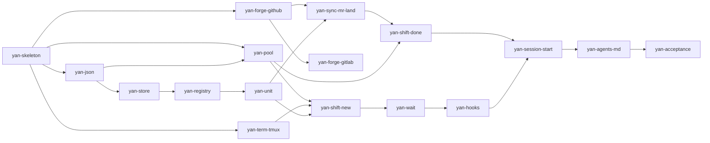

# Implementation plan

> Based on the decisions in [`design/INDEX.md`](design/INDEX.md) and the layering in [`design/architecture.md`](design/architecture.md).
> This document says what order to build things in, and how each piece is tested.
> A bare `§x` here refers to this document. References into the design are written as `design §x`, and references to another document are written as the document name plus a section number.

---

## 0. How the work is split

**Not bottom-up, layer by layer.** The problem with building bottom-up is that nothing is usable until the very last moment, so there is no feedback along the way — and by the time you discover that the supervision layer does not work, a great deal of code already depends on the assumption that it does.

Instead: **put up a minimal skeleton first (a very small one), then have every stage deliver something that actually runs and can be checked on its own.** Each step adds only the machinery that is genuinely needed at that point.

Three deliberate ordering decisions:

1. **The pool comes second, not last.** It is the largest primitive, and it is useful on its own — calling `yan tree get` by hand already has value, with no agent involved. Building it early means getting a real user early, namely the person building it.
2. **Supervision comes fourth, not last.** It is the riskiest piece and the hardest to verify incrementally. Leaving it until the end would mean discovering that the hooks do not work only after the whole system is resting on them, which would be fatal. Fourth is where there is finally something worth supervising.
3. **`AGENTS.md` is written last, but read early.** It lands last, and yet the shape of the CLI should be driven by it: while writing each subcommand, ask how the model would call it.

---

## 1. The phases

| Stage | Capability delivered | Tasks | True at the end of the stage |
| --- | --- | --- | --- |
| **P0 foundation** | skeleton plus test harness | 2 | `yan` runs, the tests run, CI is green |
| **P1 pool** | the worktree pool | 1 | **leasing and returning trees by hand works, and warm reuse really does skip the cold install** |
| **P2 bookkeeping and terminals** | storage plus terminals | 3 | create a `task`, see the queue, start a process in tmux |
| **P3 dispatch** | dispatch the first `shift` | 2 | **the first sub-agent is really working in a tree** (a person still has to watch the pane) |
| **P4 supervision** | hooks plus the watcher | 2 | a `shift` sends a notification when it finishes |
| **P5 delivery** | forge plus the merge chain | 5 | shift branch MRs, the outbound MR, clocking out and returning the tree |
| **P6 AGENTS.md and acceptance** | judgements plus bootstrapping | 2 | **the acceptance chain from [design §11](design/scope.md#11-scope-of-the-first-version) runs on Yan's own repository** |

The dependency graph (anything in the same column can run in parallel):

---

## 2. The `task` list

Each `task` has one `unit`, sized by the rule in [design §6.7](design/branching.md#67-how-big-a-unit-should-be): **the size of one outbound MR, which is how much one review can absorb.**

The "tests" column lists **the cases this particular `task` must bring with it**, not a general reminder to write tests. The shape of the test harness — the `tests/` layout and the `YAN_LIB` stand-in mechanism — is in [`architecture.md` §7](design/architecture.md#7-testability), fixed during P0 and used by everything after it.

### P0. Foundation

| id | Delivers | Tests |
| --- | --- | --- |
| `yan-skeleton` | the `bin/yan` entry point (parse the subcommand, exec `yan-<cmd>.sh`), `lib-git.sh`, the `tests/` harness, shellcheck, GitHub Actions | an unknown subcommand produces a useful error with suggestions; every `lib-git` function takes an explicit directory and **does not rely on the working directory** (still correct when called after a `cd` elsewhere); shellcheck reports nothing |
| `yan-json` | `lib-json.sh`: read, atomic write (`tmp → mv`), the `version` field | **kill -9 halfway through a write leaves the original file intact** — this is the only reason the module exists, so it has to be tested directly; a file missing `version` is rejected |

### P1. Pool

| id | Delivers | Tests |
| --- | --- | --- |
| `yan-pool` | `lib-pool.sh` plus `yan tree get\|return\|status`: leases with a random `lease_id`, conditional return, `--json`, warm reuse, backpressure, the orphan-commit guard | the eight cases below |

This is the most heavily tested task in the project, and none of the eight can be skipped:

1. `get --base X --branch Y` → the path exists, it is on branch Y, and Y is based on X.
2. **After `return`, a gitignored directory is still there** (use a stand-in for `node_modules`). This guards against someone adding `-x` to `clean` one day, which would silently turn the pool into a cold install every time — **no error, just slower**.
3. `return --if-lease-id <wrong>` → **exits non-zero, and the tree is completely untouched** (no killed processes, no reset, no cleared state).
4. Uncommitted changes present → `return` refuses.
5. A commit that has not been pushed → `return` refuses (the orphan-commit guard).
6. **Pool full → `get` fails and does not create tree number N+1** (this guards "the pool keeps N warm trees"). N comes from the per-repository setting in `repos.json`, default 8.
7. Two concurrent `get` calls never hand out the same tree.
8. When the pool is full, `yan sync`'s error message says **"the pool is full, cannot start a new `shift`"**, not "sync failed".

**Stage milestone: the pool is now usable by hand.** It is worth actually using it for a while before moving on.

### P2. Bookkeeping and terminals

| id | Delivers | Tests |
| --- | --- | --- |
| `yan-store` | `lib-task.sh` (reading and writing `task.json`, the four current scalars, `history[]`) plus `lib-log.sh` (append one line) | once an entry is in `history[]`, no operation modifies it; existing lines in `log.md` are never rewritten; a `task.json` round trip loses no fields |
| `yan-term-tmux` | the tmux implementation of `lib-term.sh`, all seven functions | **tested against real tmux**: start a `sleep 300` → `alive` is true → text sent with `send` really arrives → `read` can read it → `close` closes only the recorded pane and **the session is still there** → `list` shows one fewer. Also: `term_agent_alive` returns something unambiguous when the pane exists but the process has died |
| `yan-registry` | `yan repo-add`, `task new`, `ls`, `open` | `repo-add` is the only writer of `repos.json`; the queue produced by scanning equals what is actually in the directory (delete a task directory and `ls` immediately shows one fewer, **with nothing to synchronise**) |

Under tmux, `term_agent_alive` can only guess from process names. That is a known approximation ([design §5.7](design/agents.md#57-terminal-topology)). **Say so in a comment in the code**; it becomes an answer rather than a guess once the Herdr implementation arrives in 2→10.

### P3. Dispatch

| id | Delivers | Tests |
| --- | --- | --- |
| `yan-unit` | `yan unit add` (`target` must be given explicitly) plus `lib-hook.sh` (the `branch-name` seam) | the hook exits non-zero → **stop and report, never fall back to the built-in default**; the hook is absent → use the built-in default `yan/<task>-<unit>-r<n>`, with `n` equal to the length of `history` plus one; the branch the hook returned already exists → check it out rather than recreating it |
| `yan-shift-new` | `yan shift new`, `yan send`, `yan report`, `yan scope-check`, and the brief template | **the working-directory assertion really refuses to start when it points at the main clone** (the invariant from [design §7](design/worktree.md#7-worktrees)); every placeholder in the brief is filled in (a leftover `{...}` fails outright); `yan report` accepts only the five states and rejects a sixth word; `report` writes both the status and the signal; `scope-check` **reports without blocking** when something is outside `scope` |

**Stage milestone: the first sub-agent is really working in a tree.** There is still no supervision, so a person has to watch the pane. That is deliberate — prove the dispatch path itself is right before adding the complexity of hooks.

### P4. Supervision

| id | Delivers | Tests |
| --- | --- | --- |
| `yan-wait` | `yan wait` (three sources, the wake file, the beacon) plus `yan drain` | trigger each of the three sources on its own and assert the exit code and the wake file's contents; nothing from any of the three → exit non-zero silently; the wake file **survives** from "the watcher exits" to "the model's next turn"; the beacon is touched on every loop |
| `yan-hooks` | `hook-autoarm.sh`, `hook-turnend-guard.sh`, `.claude/settings.json` | the guard **never reads stdin** (it works normally when fed empty stdin); after blocking three times it fails open **and prints a clear warning**; the count resets when the watcher becomes healthy; the single-flight lock: two concurrent autoarms start only one watcher; each of the three conditions for "the watcher is healthy" blocks when it fails on its own (the pid in the lock is alive but the beacon is stale → block; the beacon is fresh but the lock is missing or the identity does not match → block) |

**The integration test for this stage cannot be a unit test.** It needs one manual rehearsal: run the chain with a fake `shift`, which is just `sleep 60 && yan report done "fake"`, and confirm that "the turn ends → the watcher starts → the fake `shift` reports → the model is woken" works end to end. Once is enough; write down the result.

### P5. Delivery

| id | Delivers | Tests |
| --- | --- | --- |
| `yan-forge-github` | the `lib-forge.sh` interface definition plus the GitHub implementation (four verbs) | each of the four `forge_mr_state` values is produced at least once; **the return value can only ever be one of those four** (feed it a strange API response and it must return `unknown` rather than leaking the raw text); `forge_ci_state` reduces N check runs to one green or red |
| `yan-forge-gitlab` | the GitLab implementation | the same set of cases with a different fixture. **Requires `glab` and a real GitLab target; see §4** |
| `yan-sync-mr-land` | `yan sync`, `yan mr`, `yan land`, `yan unit set` | `sync` **really exits** on a conflict and does not leave half a rebase behind; `unit set --branch` decides `end` correctly for all four forge states (merged→delivered, closed or empty→abandoned, open→ask `user`, unreachable→ask `user`); starting a new round is atomic (decide → archive → overwrite → one log line, and a failure partway leaves nothing half-done); `land` refuses without explicit authority |
| `yan-shift-done` | `yan shift done` plus `yan state` | **in the squash case, the tree is returned before the branch is deleted** (this gets its own case; see §3); `state` derives from meta plus the terminal, git, and the forge, and **does not read the last line of `run/status`** |
| `yan-session-start` | `yan session-start`, the full rebuild | kill `yan` outright, restart it, and the rebuilt picture matches reality (a `shift` that is alive is alive, one that died is dead); **no part of that picture comes from conversation memory** |

### P6. AGENTS.md and acceptance

| id | Delivers | Tests |
| --- | --- | --- |
| `yan-agents-md` | `AGENTS.md`, the judgements the model reads | read it through: every instruction points at a `yan` subcommand that actually exists; **no instruction asks the model to source a library** |
| `yan-acceptance` | run the acceptance chain from [design §11](design/scope.md#11-scope-of-the-first-version) on **Yan's own repository** | the chain from [design §11](design/scope.md#11-scope-of-the-first-version) completes with no step skipped |

---

## 3. Test strategy

From cheapest to most expensive, and from most often run to least:

| Level | Subject | Dependencies | When it runs |
| --- | --- | --- | --- |
| **shellcheck** | every script | none | every commit. The number of things it catches in bash is surprising |
| **stub-level unit tests** | subcommands | none, since every seam is a stand-in | every commit, in seconds. `tests/run.sh --fast` |
| **real-authority seams** | `lib-git`, `lib-pool`, `lib-term` | a temporary git repository and a real tmux | every pull request. CI can run these, since the runner has tmux |
| **real forge** | `lib-forge` | network, a token, a scratch repository | manually, and on pull requests with the right label. **Not part of the default CI run** |
| **ordering regressions** | the four below | varies | every pull request. See below |
| **manual rehearsal** | the whole supervision chain | a real Claude session | once during P4, and again whenever a hook changes |
| **acceptance** | the whole system | everything | once during P6 |

**The four ordering regression tests.** Each guards something that does not fail loudly, it just quietly stops working, which is exactly why it needs a test:

1. After `pool_return`, gitignored directories are still there (adding `-x` would silently degrade the pool into a cold install every time).
2. `yan shift done` returns the tree before deleting the branch (reversed, a squash merge would make the tree impossible to return).
3. `yan shift new`'s working-directory assertion really refuses (broken, a sub-agent would make changes inside the main clone).
4. `yan sync` really exits on a conflict (broken, it would leave half a rebase behind and the next `shift` would branch off the mess).

CI (GitHub Actions) runs `shellcheck` plus `tests/run.sh`, and skips the real-forge level by default.

---

## 4. What is blocking right now

| | What it blocks | What can be done now |
| --- | --- | --- |
| **the `task` id format is undecided** | `yan-registry` (P2) | just pick one; the options and the current leaning are in [design §12](design/scope.md#12-open-questions) |
| **`glab` is not installed, and there is no GitLab target to test against** | `yan-forge-gitlab` (P5) | **not blocking the main line.** The GitHub implementation is enough to run the acceptance chain from [design §11](design/scope.md#11-scope-of-the-first-version), since Yan itself is on GitHub. The GitLab implementation can wait until there is something to test against, and its interface is already fixed by the GitHub one |
| **Yan's own delivery style is undecided** | how `yan` gets built | pick one of three; see below |

The last one is a choice between three options. `no-mistakes`: every change goes through a full automated pipeline (review, tests, documentation, CI) before a pull request is opened. `direct-PR`: push a branch and open a pull request directly, with `user` and CI as the quality gate. `local-only`: no pull requests, local branches only. **Registered as `no-mistakes` for now, as the default, and changeable at any time.**

There is something worth noticing here: **`yan`'s own design explicitly does not adopt no-mistakes** ([design §11](design/scope.md#11-scope-of-the-first-version)), on the grounds that quality control falls back to `user`, CI, and review by colleagues, which is how a normal team already works. Whether to use it on the `yan` repository is a separate question, but the two are worth thinking about together.

---

## 5. What can run in parallel

If sub-agents are used to build `yan`, these can overlap:

- **P2's three tasks are fully independent** (`yan-store`, `yan-term-tmux`, `yan-registry`), so all three trees can be open at once.
- **`yan-forge-github` can start right after P0.** It does not have to wait for P1 through P4 and can run alongside the main line.
- **`yan-forge-gitlab` can be slotted in at any time**, once the interface is fixed.

The rest really is sequential: `yan-shift-new` has to wait for the pool and the terminals, and `yan-hooks` has to wait for `yan-wait`.

**Suggestion: write the first stage (P0 and P1) by hand.** Not because a sub-agent could not do it, but because this code sets the shape every later task follows — what the test harness looks like, how a subcommand sources a library, how errors are reported. Settling those conventions once, by hand, is far more accurate than writing them into a brief and hoping someone else infers them correctly.
