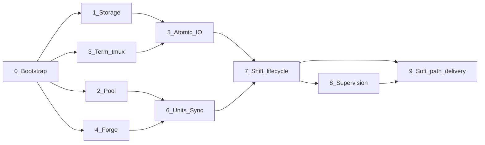

# MVP implementation plan

> Design lives in [`../td/`](../td/INDEX.md). This folder is the delivery cut: what we build first, in which order, and how each slice stays reviewable.
>
> **THIS PLAN IS FINISHED AND ITS OUTPUT HAS BEEN REPLACED.** It delivered the MVP; V2 then ported that MVP to TypeScript and Herdr and deleted the bash it describes ([`../../v2/plan/INDEX.md`](../../v2/plan/INDEX.md)). It is kept because the phase entries carry the reasoning for decisions V2 inherited rather than re-made — not as a description of any tree that exists. Every file path in it is historical.

---

## 1. Actual MVP scope

**Goal:** one full end-to-end path on a real machine — from `yan task new` / `yan continue` through dispatching a `shift`, working in a leased worktree, waking `yan`, clocking out, and opening the outbound MR — without Herdr.

| In MVP | Out of MVP (deferred) |
| --- | --- |
| Full script inventory in [Appendix C](../td/appendix.md#appendix-c-script-inventory) along the hard path | Herdr as a second `lib-term` implementation ([td §5.7](../td/agents.md#57-terminal-topology), [td §11](../td/scope.md#11-system-boundary)) |
| `backend: tmux` only; `conf/config.json` may name `herdr` but must refuse or no-op with a clear error | Push events / native `blocked` from Herdr |
| Dual harness binding for `yan`: Claude Code + Codex ([td §5.5](../td/supervision.md#55-supervision)) | Other harnesses for the main agent |
| Any shift CLI that meets [td §5.6](../td/agents.md#56-harness-requirements) | Automated quality pipelines, second-level agent trees, social entry points |
| Forge: GitHub **and** GitLab behind `lib-forge` ([td §8.4](../td/delivery.md#84-the-forge-layer)) | Mixing forges per repository on one `$YAN_HOME` |
| Built-in worktree pool ([td §7](../td/worktree.md#7-worktrees)) | Wrapping treehouse / wtpool |
| Human soft path (`ui/` + `@clack/prompts`) ([cli-ux.md](../td/cli-ux.md)) | Soft-path polish beyond the create / continue / scope-pick flows already specified |

**Product sentence for this cut:** *tmux + one forge + one `yan` harness + one shift CLI can carry a real task from create to outbound MR.* Herdr is design-complete and intentionally not implemented yet.

---

## 2. How phases are reviewed

Each phase below is meant to be **one reviewable unit** (one PR / one Agent run / one sitting for `user`).

Rules:

1. **Do not merge phases in one Agent session** unless `user` explicitly asks. Mixing pool + forge + supervision into one diff is how review dies.
2. **A phase is done when its Trace bullets pass**, not when the next phase's commands exist as stubs.
3. **Later phases may call earlier ones; earlier phases must not depend on later ones.** Stub seams (`tests/stub/`) are allowed inside a phase's own tests.
4. **Herdr work is never mixed into an MVP phase.** If `lib-term` needs a `backend` switch, MVP only implements `tmux` and fails closed on `herdr`.

Suggested Agent prompt shape: *“Implement Phase N only. Do not start Phase N+1. Leave Trace bullets runnable.”*

---

## 3. Phase map

Phases **2 / 3 / 4** can proceed in parallel after Phase 0 (independent seams). Phase 1 can also run in parallel with them. Phase 9 can start soft-path work once Phase 7's hard enter path exists; supervision (8) and soft path (9) can overlap if review bandwidth allows.

| Phase | Name | Review focus |
| --- | --- | --- |
| 0 | Bootstrap & primitives | entry point, utilities, test harness |
| 1 | Storage & registry | `task.json` / `log.md` / `repos.json` / `yan ls` |
| 2 | Worktree pool | leases, warm reuse, orphan guard |
| 3 | Terminal (tmux) | seven `term_*` functions, ids not labels |
| 4 | Forge | four verbs, closed return sets |
| 5 | Atomic shift I/O | `report` / `send` / `drain` / `state` / `scope-check` |
| 6 | Units & sync | `unit add/set`, `yan sync`, conflict hand-off |
| 7 | Shift lifecycle | `shift new` / `shift done` / hard `continue` / `session-start` |
| 8 | Supervision | `yan wait`, hooks, Claude + Codex bindings |
| 9 | Soft path & outbound delivery | Clack UX, `yan mr`, `yan land`, `AGENTS.md` |

---

## 4. Phases

### Phase 0 — Bootstrap & primitives

**Delivers:** `bin/yan`, `lib-json.sh`, `lib-git.sh`, `tests/run.sh` + stub pattern, bootstrap dependency checks (`jq`, `git`; Node listed but unused until Phase 9), `conf/config.json` sample shape (gitignored real file), empty `mem/` / `tasks/` / `repos/` conventions.

**Does not deliver:** any seam or subcommand beyond “dispatch exists”.

**Trace**

- `yan` with an unknown subcommand exits non-zero with a short help list
- JSON write always goes `tmp → mv` and every written file has `version`
- `lib-git` refuses to run without an explicit directory argument; never uses `--force`
- `YAN_LIB=tests/stub` sourcing shape works for a trivial smoke test

**td:** [architecture §3–4](../td/architecture.md), [INDEX §2–3](../td/INDEX.md#2-storage-criteria)

---

### Phase 1 — Storage & registry

**Delivers:** `lib-task.sh`, `lib-log.sh`, `yan repo-add`, `yan ls`, `yan open`.

**Does not deliver:** units that cut branches, soft prompts, terminals.

**Trace**

- `yan repo-add` clones into `repos/` and is the only writer of `mem/repos.json`
- Creating a minimal `tasks/<id>/task.json` + `brief.md` + empty `log.md` is possible via library helpers (or a thin internal helper used later by `task new`)
- `yan ls` with no id derives the queue from disk; with an id prints units / live shifts without storing a backlog file
- `lib-log` appends only; rewriting an existing line is impossible through the API

**td:** [memory](../td/memory.md), [INDEX §3](../td/INDEX.md#3-directory-layout), [architecture §5.1 `yan ls`](../td/architecture.md#51-atomic-commands)

---

### Phase 2 — Worktree pool

**Delivers:** `lib-pool.sh`, `yan tree get|return|status`.

**Does not deliver:** spawning agents into the tree.

**Trace**

- `yan tree get --base … --branch …` leases a tree, cuts the shift branch, returns `{path, lease_id, holder}`
- `return` uses `reset --hard` + `clean -fd` and **never** `-x` (gitignored dirs survive)
- Orphan-commit guard: uncommitted or unpushed HEAD → refuse return (unless user-forced later; MVP may omit `--force` entirely)
- Full pool → `get` fails with backpressure (no silent growth)
- Conditional return (`--if-lease-id` / `--if-lease-holder`) refuses mismatched identity before any destructive step

**td:** [worktree.md](../td/worktree.md)

---

### Phase 3 — Terminal seam (tmux only)

**Delivers:** `lib-term.sh` with the seven functions, wired only to tmux. `backend: herdr` → clear error.

**Does not deliver:** Herdr, supervision loop, shift orchestration.

**Trace**

- `term_container_create` / `term_agent_start` / `term_list` / `term_agent_close` round-trip on a real or CI-safe tmux
- Ids recorded (pane/window), never locate by label alone
- `term_send` sends text and Enter as separate steps
- `term_agent_close` closes exactly one recorded agent, never the session
- Detached / no-focus behaviour (`-d`) so create/start does not steal focus
- `term_agent_alive` returns only `alive | dead | unknown`

**td:** [agents §5.7](../td/agents.md#57-terminal-topology)

---

### Phase 4 — Forge layer

**Delivers:** `lib-forge.sh` (`forge_mr_create`, `forge_mr_state`, `forge_mr_merge`, `forge_ci_state`) for GitHub and GitLab via `conf/config.json`.

**Does not deliver:** `yan mr` / `yan land` orchestration (Phase 9), or branching on `forge.kind` outside this file.

**Trace**

- Callers speak only forge vocabulary; no `gh`/`glab` flags leak upward
- `forge_mr_state` ∈ `{merged, closed, open, unknown}` only
- `forge_ci_state` ∈ `{green, red, pending, none}` only
- Bootstrap checks only the CLI selected by `forge.kind`
- Stub forge in `tests/stub/` can replay a fixed MR-state sequence

**td:** [delivery §8.4](../td/delivery.md#84-the-forge-layer), [Appendix D](../td/appendix.md#appendix-d-configuration)

---

### Phase 5 — Atomic shift I/O

**Delivers:** `yan report`, `yan send`, `yan drain`, `yan state`, `yan scope-check`.

**Depends on:** Phase 1 (paths), Phase 3 (`send` / `state` terminal facts). Forge queries in `state` may use Phase 4 or stubs.

**Trace**

- `yan report` accepts only the five allowed states; appends `run/status` and touches `run/signal` in one go
- Every `run/status` line is an event (documented); `yan state` does **not** treat `tail -1` as current state
- `yan send` types text once and can retry Enter alone
- `yan drain` reads and clears the wake file
- `yan scope-check` reports out-of-scope paths and never blocks

**td:** [agents §5.4](../td/agents.md#54-communication), [delivery §8.3](../td/delivery.md#83-enforcement)

---

### Phase 6 — Units & sync

**Delivers:** `yan unit add`, `yan unit set`, `yan sync`, `lib-hook.sh` + optional `conf/hooks/branch-name`.

**Depends on:** Phase 2 (short lease for sync), Phase 4 (decide `end` when branch changes).

**Trace**

- `unit add` requires explicit `target`; hook non-zero → stop, never fall back to built-in default
- `unit set --branch` archives the old round into `history[]` with `at` in one atomic operation
- `yan sync` leases briefly → fetch → rebase/merge `target` → push → return; **exits immediately on conflict** (no resolve in script)
- Pool-full during sync surfaces as “cannot start / pool full”, not a vague sync failure

**td:** [branching](../td/branching.md), [boundaries §10](../td/boundaries.md#10-seams-for-outside-authorities)

---

### Phase 7 — Shift lifecycle (hard path E2E spine)

**Delivers:** `yan shift new`, `yan shift done`, hard-path `yan continue`, `yan session-start` (rebuild summary). Minimal `AGENTS.md` stubs only if needed to spawn; full judgements wait for Phase 9.

**Depends on:** Phases 2–6.

**Trace**

- `shift new`: sync → lease tree → write brief → start agent in container → assert cwd ≠ main clone (refuse otherwise)
- `shift done` order: MR merged → `outcome` → `rm -rf run/` → **return tree** → **then** delete remote shift branch
- Hard `continue --task <id>` creates/attaches the task container and starts `agents.yan`
- Second `yan` on the same task is refused
- `session-start` rebuilds from disk + terminal + pool + forge with no durable `yan` state files

**td:** [agents §5.1–5.3](../td/agents.md), [architecture §5.2](../td/architecture.md#52-orchestrating-commands)

---

### Phase 8 — Supervision

**Delivers:** `yan wait` (long + `--seconds N`), `hook-autoarm.sh`, `hook-turnend-guard.sh`, `.claude/settings.json`, `.codex/hooks.json`.

**Depends on:** Phase 5 (`signal` / drain), Phase 3 (`term_agent_alive` / `term_read`).

**Trace**

- Three sources only: `run/signal`, `term_agent_alive`, pane hash unchanged
- Claude: SessionStart → `yan session-start`; Stop autoarm runs long `yan wait` in hook foreground (never `&`); guard uses own budget / identity rules
- Codex: no autoarm; model loops `yan wait --seconds N`; Stop guard remains
- Single-flight lock + wake file + beacon behave as in [supervision.md](../td/supervision.md)
- No PR-poll fourth source

**td:** [supervision.md](../td/supervision.md)

---

### Phase 9 — Soft path & outbound delivery

**Delivers:** `ui/` + `@clack/prompts`, soft `yan task new` / `yan continue` / monorepo scope pick, `yan mr`, `yan land`, full `AGENTS.md` judgements for split / dispatch / escalate.

**Depends on:** Phase 7 hard enter path; Phase 4 forge; Phase 8 optional for a polished demo but not required to open an MR.

**Trace**

- Soft path on TTY with missing args → Clack → hard path with full flags; non-TTY missing args → refuse listing flags
- `yan task new` ends with `user` inside the task container (create + enter)
- `yan continue` without id selects among incomplete tasks on soft path only
- Monorepo detection offers package multiselect; default one unit per package
- `yan mr` opens outbound MR and writes `unit.mr`; `yan land` merges only when `user` asks
- Agents never import Node/Clack

**td:** [cli-ux.md](../td/cli-ux.md), [delivery](../td/delivery.md), [boundaries §9](../td/boundaries.md#9-what-yan-may-write)

---

## 5. Definition of “MVP done”

All of the following, on tmux, without Herdr:

1. Register a repo → create a task (soft or hard) → enter session  
2. Dispatch a shift into a leased worktree on a shift branch  
3. Shift reports → `yan` wakes (Claude autoarm **or** Codex checkpoint)  
4. Shift MR merges into integration → `shift done` cleans up in the correct order  
5. Outbound MR opened with `yan mr`; merge only via `yan land` when asked  
6. Cold-path restart: close `yan`, `yan continue` / SessionStart rebuild, no lost bookkeeping  

That is the E2E bar. Soft-path polish and dual-forge on both machines can be uneven as long as one forge + one `yan` harness + tmux clears the list.

---

## 6. Explicit non-goals until after MVP

- Herdr implementation and Herdr-specific supervision shortcuts  
- Plugin / backend frameworks beyond the existing seam files  
- Automatic trimming of `tasks/`, git-versioning policy for `$YAN_HOME` (still open in [td §12](../td/scope.md#12-open-questions))  
- Sparse-checkout, quality pipelines, multi-`yan` trees  

---

## 7. Working agreement with Agents

Implementation conventions established by Phase 0 — the two supported runtimes, the portability constraints, the sourcing form, the `tests/` layout — are in [`conventions.md`](conventions.md). Read it before starting any phase.

| Do | Don't |
| --- | --- |
| Name the phase number in the PR / commit summary | Implement “the rest of the spine” unprompted |
| Add or update Trace-related tests under `tests/` for that phase | Expand `lib-term` toward Herdr “while we are here” |
| Keep seams from calling each other | Put forge or tmux commands outside their lib |
| Prefer stubs for not-yet-built seams | Block a phase on a later phase's orchestrator |
