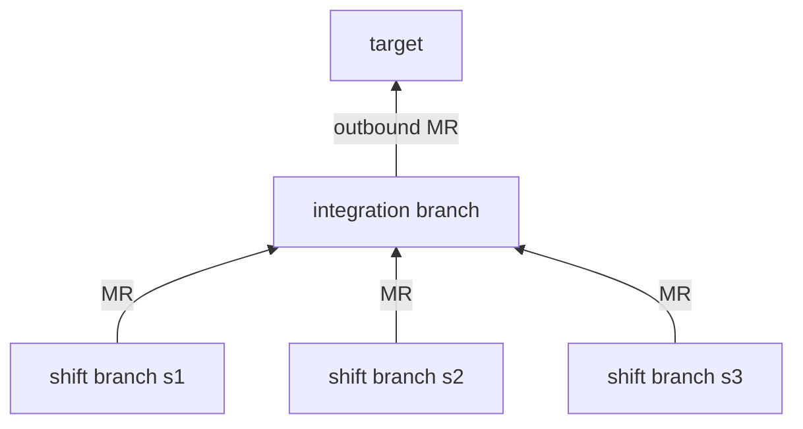

# `yan` design

> This document records design decisions. It is not an implementation specification. Each decision tries to carry its "why" with it, because when you come back to change something six months later, the reasoning matters more than the conclusion.

This is the backbone. It starts with three things the rest of the design keeps referring back to — the design principles, the glossary, and the storage criteria — and then walks through the system one part at a time, saying what each part is responsible for and where it sits in the overall flow.

---

## 0. What `yan` is

`yan` is a work orchestration system for one person. `user` describes something that needs doing, `yan` breaks it into pieces that can be handed out, each piece goes to a single-use sub-agent working in an isolated git worktree, and the result is delivered as a merge request on the forge configured for this machine.

Throughout the process `user` only has to think about understanding the requirement, designing the approach, and reviewing the pieces as they come back. Nothing about the mechanics — which worktree, which branch name, which agent is doing which part — needs their attention. And because several shifts can run at once, keeping a queue of work moving takes much less mental effort.

### Design principles

1. **Do not store state you can derive.** The directory structure, git, and the forge are the source of truth.
2. **One owner per piece of information.** Every piece has exactly one writer and one point at which it is read. This is how state stays consistent.
3. **Prose makes judgements and scripts do the steps that need no judgements to keep the primitive.**
4. **`user` and the agents use the same entry point.** Every action `yan` can take is offered as a CLI command, `user` can run it directly, and both see the same state.
5. **Anything irreversible goes through a script, and is refused by default.**

---

## 1. Glossary

This is the single source of naming for the whole system. Scripts, documents, and `AGENTS.md` all use these words.

| Word | What it is | Lifetime |
| --- | --- | --- |
| `task` | one thing that needs doing | long: weeks or months |
| `unit` | one delivery channel for that task | as long as the `task` |
| `scope` | which paths a `unit` is allowed to change | as long as the `unit`, and it can be widened explicitly |
| `shift` | one piece of work handed out, one per sub-agent | short: hours |
| integration branch | the `unit`'s current working branch. Shifts branch off it and merge back into it | one round of delivery; once delivered or abandoned, a new one takes over ([§6.3](branching.md#63-how-the-integration-branch-changes)) |
| shift branch | the branch one `shift` works on, cut from the integration branch and merged back into it | as long as the `shift` |
| `target` | the branch the integration branch is ultimately merged into (master, release/x, any branch) | changeable, and it is a decision |
| `yan` | the main agent, and `user`'s only interface | medium-lived, with no persistent state |

Read as a sentence: a `task` has one or more `unit`s; a `unit` is pushed forward by a series of `shift`s; each `shift` works on its own shift branch and merges back into the integration branch; the integration branch is eventually delivered to `target`.

One implementation note: `shift` is a shell builtin. `yan shift new` is fine as a subcommand, but do not use `shift` as a variable name in a script — use `sid`.

---

## 2. Storage criteria

These three rows decide what gets stored and where. They are the most frequently cited thing in the whole design.

| Category | Examples | What to do |
| --- | --- | --- |
| facts | branches, commits, merge history, diffs | they live in git, and are never mirrored |
| state | whether an MR is open or merged, whether CI is green, whether there is a conflict | look it up on the forge when needed, never mirror it |
| decisions | `branch`, `target`, `scope`, `mode`, how units are divided, whether to merge | must be stored by us, and the history of changes is worth keeping |

What follows from that: which shift branches a `unit` has used, how far the integration branch has caught up with `target`, what state an MR is in — none of that is stored. It is looked up at the moment it is needed. But "which branch are we working on, and where do we intend to merge it" is something neither git nor the forge knows, especially before an MR has been opened, so it has to be stored.

Note that "why" is not a structured decision. It is narrative. Narrative — "where we have got to, what is still missing" — is exactly the sub-category worth calling out inside the third row: it is prose, no tool can derive it, and it does not belong in JSON. So it lives in `log.md` ([§4.2](memory.md#42-logmd-the-narrative-layer)).

### Choosing a format

The test is who reads the file. If a script reads it, JSON. If a model or `user` reads it, Markdown. **A file should not have two identities.** The test is not "might we want to process this programmatically some day".

| JSON | Markdown |
| --- | --- |
| `mem/repos.json`, `tasks/<id>/task.json`, `run/meta.json` | `mem/user.md`, `mem/learnings/*.md` |
|  | `brief.md`, `log.md`, `report.md`, `outcome.md`, `run/status` |

`run/status` stays as appended lines of plain text, because it has to survive a crash without damaging what is already there, and a JSON array cannot do that.

Using JSON costs three things, all handled in one place in the scripts:

1. **Atomic writes.** Always write a temporary file and then `mv` it. JSON replaces the whole file, so an interruption halfway destroys all of it. Appending to Markdown is naturally resistant to that.
2. **A `version` field** in every JSON file. This is the one hook left for a future schema migration.
3. **`jq` becomes a hard dependency**, so the bootstrap check has to list it.

The human soft path adds one more bootstrap dependency: **Node**, for `@clack/prompts` only ([cli-ux.md](cli-ux.md)). Agents and the hard path do not need it.

---

## 3. Directory layout

```
$YAN_HOME/
  AGENTS.md                    what yan is responsible for (the only always-loaded context)
  bin/  docs/  ui/             ui/ is the Node soft path for Clack prompts ([cli-ux.md](cli-ux.md))

  mem/                         long-lived memory, readable and editable by hand
    user.md                    user's preferences and working style
    repos.json                 the repository registry; fields in [Appendix D](appendix.md#appendix-d-configuration)
    learnings/general.md       pitfalls that apply across repositories
    learnings/<repo>.md        pitfalls specific to one repository

  tasks/<id>/                  * the directory itself is long-lived
    task.json                  structured decisions: units / scope / delivery history
    brief.md                   the task contract
    log.md                     append-only narrative progress
    report.md                  what was learned (conclusions)
    artifacts/                 * project output that does not belong in a real repository
    shifts/<sid>/
      brief.md                 the work order                  ← long-lived
      outcome.md               what this shift did, and what it concluded  ← long-lived
      run/                     * the only throwaway layer; deleted entirely at clock-out
        meta.json              tree path / terminal id / shift branch name / agent CLI
        status                 the event stream (append-only)
        signal                 the wake marker

  conf/                        local choices, gitignored — `config.json` plus optional hooks; see [Appendix D](appendix.md#appendix-d-configuration)

  repos/                       clones; yan only reads them (the one exception is git fetch)
```

Lifetime is expressed by directory, not by a list of files: `tasks/<id>/` is long-lived, `.../run/` is throwaway. So a `shift` clocking out is `rm -rf .../run/` plus one `yan tree return`. A single `rm -rf` cleans up completely, whereas a list of "which files should be deleted" will eventually miss one.

**There is no backlog file.** The queue is a view produced by scanning: `yan ls` reads `tasks/*/task.json`. That removes the single most bug-prone thing in the whole system. The same command with a task id (`yan ls <id>`) is the deeper view of one task — units, live shifts, each shift's branch and worktree absolute path — still derived, never stored.

**Worktrees are not in this tree.** `yan tree`'s pool lives at `~/.yan-trees/<repo>-<hash>/N/<repo>`, which makes `repos/` purely a git source and a place to read code; a `shift` never touches it. The pool's runtime records (the leases) also live in the pool's root directory rather than in `$YAN_HOME`, because they belong to the pool, not to a task.

---

# The backbone

## Memory

Every time `yan` starts, it needs to know two things: what kind of person `user` is, and what pitfalls have already been hit in these repositories. Both live in `mem/`, the only memory in the system that outlives a task.

`mem/user.md` is written only when `user` asks, because it records judgements about a person and a wrong entry keeps misleading. `mem/learnings/` may be written by `yan` on its own once there is evidence, because a wrong entry there is cheap and asking every time would mean nothing gets written at all. Progress inside a task does not go into memory; it is appended one line at a time to `log.md`, which is where the narrative sub-category from §2 ends up, and which `user` and the agents read as the same file. There is one more kind of thing that goes neither into the repository nor into memory: artifacts (prototypes, screenshots, research data). Those have to be written outside the worktree, or they are either wiped or accidentally committed into the work repository.

→ [`memory.md`](memory.md): [§4.1](memory.md#41-who-may-write-what) who may write what · [§4.2](memory.md#42-logmd-the-narrative-layer) `log.md` · [§4.3](memory.md#43-artifacts) artifacts · [§4.4](memory.md#44-what-not-to-store) what not to store

## Human CLI UX

`user` and the agents share the same subcommands, but not the same input style. On a TTY, missing arguments become Clack prompts (`text` / `select` / `multiselect`); with full flags, or without a TTY, the same commands run silently or refuse with the flags to pass. `yan task new` is the strong create path: title, description, involved repos, monorepo-aware `scope`, unit(s), then the task container and main agent — no separate start step. Coming back later is `yan continue` (select a task if no id). Node is a dependency only for that interactive soft path.

→ [`cli-ux.md`](cli-ux.md): soft vs hard path · `@clack/prompts` · `yan task new` · `yan continue` · monorepo scope picking

## Agents and shifts

`yan` is the main agent and `user`'s only interface while `user` is still able inspect the shift through tmux/herdr panel. The code is actually written by single-use sub-agents, and each piece of work handed to one is called a `shift`.

One `yan` handles one `task`, which keeps its context budget bounded and independent of how many tasks exist. `yan` stores no running state of its own; every startup rebuilds the whole picture from what is actually there, which makes closing it and opening a new one a non-event. Dispatching a `shift` means writing a brief, leasing a tree, and starting a terminal. The `shift` works only inside its own tree, and appends a line to `run/status` only when something needs `yan` to act. Its condition for clocking out is objective: the shift branch's MR has been merged into the integration branch. The teardown has a fixed order, and returning the tree must come before deleting the remote shift branch. How `yan` and a `shift` talk to each other, and which events need no model at all, are also in this section.

→ [`agents.md`](agents.md): [§5.1](agents.md#51-lifetime-tiers) lifetime tiers · [§5.2](agents.md#52-one-yan-per-task) one `yan` per `task` · [§5.3](agents.md#53-the-life-of-a-shift) the life of a `shift` · [§5.4](agents.md#54-communication) communication · [§5.6](agents.md#56-harness-requirements) harness requirements · [§5.7](agents.md#57-terminal-topology) terminal topology

## Supervision

A `shift` runs in its own terminal for hours with nobody watching it. This layer makes sure that both "it finished" and "it is stuck" reach `yan`, without depending on the model remembering to check.

The watcher is `yan wait` (three sources: signal, agent alive, pane hash). Claude Code arms it from a long-lived Stop autoarm (`asyncRewake`); Codex has no equivalent async Stop, so the model loops `yan wait --seconds N` instead, with a Stop guard that blocks clocking out while supervision responsibility remains. SessionStart only rebuilds via `yan session-start` — it does not run the 180s wait. Harness and multiplexer stay different axes ([§5.6](agents.md#56-harness-requirements), [§5.7](agents.md#57-terminal-topology)).

→ [`supervision.md`](supervision.md): [§5.5 supervision](supervision.md#55-supervision)

## The branch model

Delivery rests on a two-level structure: several shift branches merge into one integration branch, and the integration branch merges into `target` as a whole.



Each `shift` gets one shift branch and clocks out when it is merged, which gives a `shift`'s life an objective end condition. Concurrency is isolated for free, since each `shift` has its own branch and its own tree. The structure also produces two levels of review: `user` accepts the shift branch level, and only the integration branch level goes to colleagues, so colleagues see exactly one MR. The integration branch is not long-lived — it gets replaced wholesale — which is why a `unit` keeps its current state as a few scalars and its history as an append-only array. Naming matters too: shift branch names always belong to `yan`; how the integration branch is named or created is `user`'s decision ([§6.5](branching.md#65-who-names-branches)).

→ [`branching.md`](branching.md): [§6.1](branching.md#61-branch-structure) branch structure · [§6.2](branching.md#62-two-levels-of-review) two levels of review · [§6.3](branching.md#63-how-the-integration-branch-changes) how the integration branch changes · [§6.4](branching.md#64-the-shape-of-a-unit) the shape of a `unit` · [§6.5](branching.md#65-who-names-branches) who names branches · [§6.6](branching.md#66-yan-never-parses-branch-names) never parsing branch names · [§6.7](branching.md#67-how-big-a-unit-should-be) how big a `unit` should be

## Worktrees

A `shift` never touches a main clone. It works in a leased worktree, and those trees are managed by a pool built into `yan`.

`yan tree get` leases a tree for a given integration branch and shift branch name; `yan tree return` gives it back. The only reason the pool exists is warm reuse: returning a tree uses `git clean -fd` and never `-x`, so gitignored dependencies and build caches survive from one `shift` to the next, which on a large monorepo saves a cold install every time. Before a tree is returned there is one question to answer: would destroying it lose anything? Two git commands answer it, and it is a weaker test than "has the work landed".

→ [`worktree.md`](worktree.md): [§7 worktrees and the pool](worktree.md#7-worktrees)

## Delivery modes

"How far the work goes before it stops" and "who may press merge" are two separate axes, and `yan` keeps them separate.

`mode` has three settings. `scout` investigates without changing code, `branch` stops at a local branch, and `mr` goes all the way to a pushed branch with an MR opened. The default is `mr`, because pushing to a remote is the best backup available. Enforcement does not use an isolation mechanism; startup arguments plus one `yan scope-check` before landing are enough, and going outside `scope` means widening it explicitly rather than being blocked. The part that actually talks to the outside world is the forge layer — `yan`'s remote git seam — which hides GitHub versus GitLab behind four verbs; provider config is machine-global in `conf/config.json` ([Appendix D](appendix.md#appendix-d-configuration)).

→ [`delivery.md`](delivery.md): [§8.1](delivery.md#81-mode-and-authority) `mode` and authority · [§8.2](delivery.md#82-the-three-modes) the three modes · [§8.3](delivery.md#83-enforcement) enforcement · [§8.4](delivery.md#84-the-forge-layer) the forge layer

## Boundaries

Once all of that is in place, one more line is needed: which actions `yan` may take on its own, and which have to wait for `user`.

`yan` writes only its own bookkeeping. It never touches a main clone except with `git fetch`. A `shift` writes only in its own three places plus the tree it leased. Side effects on the outside world are divided by a single line: inside your own branches and your own machine, act freely; anything that affects `target` or that a colleague will see requires `user` to say so. How the integration branch is named or created is `user`'s decision; when that decision is outsourced, it goes through an opt-in seam under `conf/hooks/` ([§10](boundaries.md#10-seams-for-outside-authorities)).

→ [`boundaries.md`](boundaries.md): [§9](boundaries.md#9-what-yan-may-write) what `yan` may write · [§10](boundaries.md#10-seams-for-outside-authorities) seams for outside authorities

## Scope and open questions

The design is complete at that point. What is left is deciding how much goes into the first version, and listing the things that are not settled.

The first version is one `yan` entry point plus the subcommands in Appendix C, 2 hooks, 8 libraries, and a Node soft path for Clack prompts ([cli-ux.md](cli-ux.md)). It is accepted when the whole chain runs end to end on `yan`'s own repository. It is much smaller than comparable orchestration systems, not because it is written better, but because none of the reasons those systems grew apply here. The road after that has three stages, and Herdr will definitely be supported, just not yet.

→ [`scope.md`](scope.md): [§11](scope.md#11-scope-of-the-first-version) scope of the first version · [§12](scope.md#12-open-questions) open questions

## Code structure

Everything above is the "why". What shape those decisions take once they become files is a separate question.

The whole of `bin/` is produced by two independent ways of cutting the code. Dependencies only ever point downwards. The only thing a model may call is `yan <cmd>`; it never sources a library. Within that structure, subcommands are split into atomic and orchestrating ones, and the test is whether a command represents one indivisible core capability. The layering exists for testability: the seams are the only things that touch the outside world, so testing a subcommand means replacing the seams with stand-ins. Human prompts live beside that stack, not inside the seams ([cli-ux.md](cli-ux.md)).

→ [`architecture.md`](architecture.md): layering, module responsibilities, repository layout, testability

## Appendices

Four lists to look things up in: the memory read and write contract, `yan`'s file system boundary, the script inventory, and configuration (inventory plus sample).

→ [`appendix.md`](appendix.md): [Appendix A](appendix.md#appendix-a-memory-read-and-write-contract) / [B](appendix.md#appendix-b-file-system-boundary-for-yan) / [C](appendix.md#appendix-c-script-inventory) / [D](appendix.md#appendix-d-configuration)
