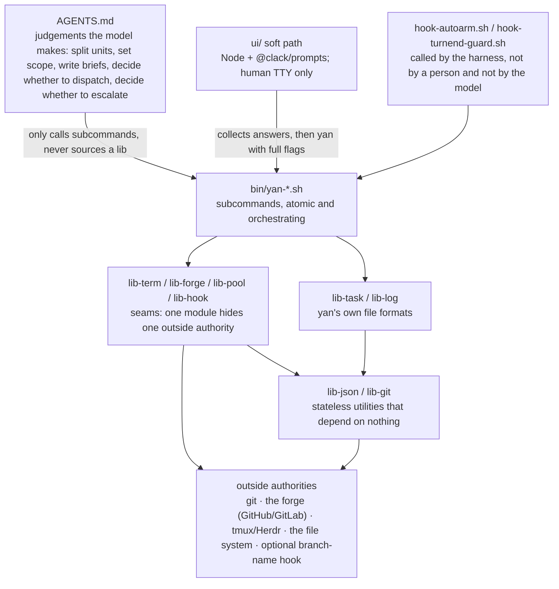

# `yan` architecture

> [`INDEX.md`](INDEX.md) says why. This document says where the code goes, what may call what, and how it is tested.
> A bare `§x.y` in this document refers to this document. References into the td documents are always written as `td §x.y`.

---

## 1. How the code is divided

The whole structure comes from two independent ways of cutting it. There is no third.

**Cut one: judgements versus steps.** Judgements, which the model reads, go in `AGENTS.md`. Steps that need no judgement go in `bin/` and are carried out by scripts. The dividing line is design principle 3 ([td §0](INDEX.md#0-what-yan-is)): a script should not contain an `if` about business meaning, and if it does, something is usually in the wrong layer.

**Cut two: hiding an outside authority versus hiding one of our own formats.** `lib-forge.sh` is the remote git seam: it hides which forge this machine uses (GitHub or GitLab), so it is thick. `lib-log.sh` hides only "append one line", so it is thin. Thin is the right answer there, because it is not hiding complexity; it is enforcing one invariant (never rewrite an existing line). Giving both kinds of module the same name would make it easy to misjudge how much belongs inside them.

---

## 2. What may call what

**Dependencies only point downwards, never up.**



`lib-pool` calls `lib-git`, because the pool has to run `worktree add`, `reset`, and `clean`. That is not an exception: a seam calling a stateless utility is exactly the kind of downward dependency the diagram shows.

The rule that actually needs guarding is a different one: **seams never call each other.** `lib-term` does not call `lib-forge`, and `lib-forge` does not call `lib-pool`. Each seam hides one outside authority, so there should be no edges between them, and no first exception.

**The model never sources a library; it can only run `yan <cmd>`.** This is design principle 4 (`user` and the agents share one entry point) expressed in the structure: `user` and the agents can call exactly the same set of things, no more and no less. The soft path under `ui/` is for people only ([cli-ux.md](cli-ux.md)); it is not a second entry point for agents.

---

## 3. Repository layout

`$YAN_HOME` is this clone itself, so the tracked code and the gitignored private data live in one tree. The reasons: bootstrapping is simplest that way, and a single-person tool does not need "install once, run N homes".

```
$YAN_HOME/
  AGENTS.md                  judgements the model reads. The only always-loaded context
  bin/
    yan                      entry point: parse the subcommand, exec the matching file
    yan-<cmd>.sh             subcommands, one file each (§5); hard path
    lib-term.sh              seam: terminals
    lib-forge.sh             seam: the remote git forge (GitHub / GitLab)
    lib-pool.sh              seam: the worktree pool
    lib-hook.sh              seam: the outside authorities under conf/hooks/
    lib-task.sh              storage: task.json
    lib-log.sh               storage: log.md
    lib-json.sh              utility: atomic writes plus the version field
    lib-git.sh               utility: run git in a given directory
    hook-autoarm.sh          Stop hook (Claude asyncRewake only)
    hook-turnend-guard.sh    Stop hook (blocking; --claude / --codex)
  ui/                        Node soft path only: `@clack/prompts` wrappers that collect answers then exec `yan <cmd>` with full flags ([cli-ux.md](cli-ux.md))
  .claude/settings.json      Claude: SessionStart + guard + autoarm
  .codex/hooks.json          Codex: SessionStart + guard only (no autoarm)
  conf/                      local choices (`config.json`, optional hooks); see [td Appendix D](appendix.md#appendix-d-configuration)
  docs/                      the MVP td documents
  tests/                     one per subcommand, with stand-ins for the seams (§7)

  mem/  tasks/  conf/  repos/    runtime data; see td §3
```

One naming convention: **`bin/` contains only three prefixes** — `yan-*` for subcommands, `lib-*` for libraries, `hook-*` for hooks. The file name tells you which layer it is in and who may call it. Human-only prompt code lives under `ui/`, not under `bin/`, so agents never confuse it with a primitive.

---

## 4. Module responsibilities

### 4.1 Utilities

Both of these are stateless and depend on nothing. `lib-git.sh` in particular is purely functional: give it a path and an action, and it does not need to know what a `task`, a `unit`, or a `shift` is.

| Module | Responsibility | Invariants it enforces |
| --- | --- | --- |
| `lib-json.sh` | read and write JSON | always write via `tmp → mv`; every file carries a `version` field. The reasoning for both is in [td §2](INDEX.md#2-storage-criteria) |
| `lib-git.sh` | run git in a given directory: branches, fetch, rebase, merge, push, worktree, `status --porcelain` | only accepts an explicit directory argument and **never relies on the working directory**. Never uses `--force` |

### 4.2 Storage

Both are thin, and thin is right. They do not exist to hide complexity; they exist so that "write atomically" and "append only" each have exactly one place where they are enforced, rather than being spread across twenty call sites.

| Module | Responsibility | Invariants it enforces |
| --- | --- | --- |
| `lib-task.sh` | reading and writing `task.json`: units, `scope`, the four scalars `branch`/`target`/`mode`/`mr`, `history[]`, the completion flag | `history[]` is **append-only**. The four current scalars are kept separate from the history, rather than "current is the last array element" ([td §6.4](branching.md#64-the-shape-of-a-unit)) |
| `lib-log.sh` | append one line to `log.md` | **append-only; existing lines are never rewritten**, which is why it never produces a conflict |

### 4.3 Seams

| Module | What it hides | Interface | Depth |
| --- | --- | --- | --- |
| `lib-term.sh` | the differences between tmux and Herdr | seven functions | medium. What it hides, what each of the seven functions does, and what adding Herdr involves are all in [td §5.7](agents.md#57-terminal-topology) |
| `lib-forge.sh` | which forge this machine uses, and the five differences between GitHub and GitLab | four verbs | **thick**, and the clearest deep module here. Config shape in [Appendix D](appendix.md#appendix-d-configuration); differences and return values in [td §8.4](delivery.md#84-the-forge-layer) |
| `lib-pool.sh` | the worktree pool | `pool_get`, `pool_return`, `pool_status` | thick. Leases, the warm-reuse contract, the test for returning a tree, and the orphan-commit guard are all in [td §7](worktree.md#7-worktrees) |
| `lib-hook.sh` | the calling protocol for `conf/hooks/` ([td §10](boundaries.md#10-seams-for-outside-authorities)) | `hook_call <name> <json>` | thin. But it is the **only** place allowed to execute anything under `conf/` |

Three rules:

1. **Return values must come from a closed set defined by `yan`, not be the outside authority's own words.** `forge_mr_state` returns only `merged | closed | open | unknown` (where those four come from is in [td §8.4](delivery.md#84-the-forge-layer)), and `term_agent_alive` returns only alive, dead, or unknown.
2. **Seams do not decide anything.** A seam reports facts; the subcommand decides what to do. `forge_ci_state` returning `red` is a fact; "red means dispatch a new `shift` to fix it" is the subcommand's business.
3. **Seams do not write the bookkeeping under `$YAN_HOME`.** A seam only touches its own outside authority.

All four seams share one failure mode: degrading into a shallow module, where every function is a one-line pass-through, return values leak out untouched, and the caller still has to know which system it is talking to. The full argument, and the one way to avoid it, are in [td §8.4](delivery.md#84-the-forge-layer).

---

## 5. Subcommands

Each subcommand is its own file, like git. Do not write one giant script that does everything, because each subcommand has to be readable on its own and testable on its own.

Whether a subcommand is atomic or orchestrating depends on **whether it represents one indivisible core capability**. If it does, it is atomic. If it only makes sense as several capabilities chained in order, it is orchestrating. That is the test because the atomic commands are `yan`'s primitives, and being indivisible is what makes something a primitive.

### 5.1 Atomic commands

Why some of these have to be scripts rather than something the agent does itself is in [td §5.4](agents.md#54-communication).

| Command | Responsibility |
| --- | --- |
| `yan report <state> "<note>"` | append to `run/status` and touch `run/signal`. Accepts only the five allowed states |
| `yan send <sid> "<line>"` | send one line to a `shift`. The text and the Enter key go separately |
| `yan drain` | read the wake file and clear it. The first thing the model does after being woken |
| `yan scope-check <sid>` | `git diff --name-only` plus prefix matching. **Reports only; never blocks** ([td §8.3](delivery.md#83-enforcement)) |
| `yan tree get\|return\|status` | the user-facing entry point to the pool |
| `yan ls` | with no argument: scan `tasks/*/task.json` and render the queue. With a task id: print that task's related facts in one place — its units (integration branch, `target`, `mode`, `scope`), and every live `shift` with **shift branch name** and **worktree absolute path** (from `run/meta.json`, checked against the pool when needed). Optional `--json`. A pure derived view; it stores nothing |
| `yan open <id>` | open a task directory or its artifacts |
| `yan repo-add <url>` | register a repository and clone it into `repos/`. The only writer of `repos.json` |
| `yan unit set --branch` | ask the forge to decide `end` → move the old round into `history[]` with `at` → overwrite the current fields → add a log line. **Starting a new round is one atomic operation**, and once the decision is in the history the forge is never asked again ([td §6.4](branching.md#64-the-shape-of-a-unit)) |
| `yan mr` | open the outbound MR and write `unit.mr`. Authority is in [td §9.2](boundaries.md#92-external-side-effects) |
| `yan state <sid>` | derive the state from `run/meta.json` plus the terminal, git, and the forge. **The current state can only be derived; it is never the last line of `run/status`** ([td §5.4](agents.md#54-communication)) |
| `yan wait` | watch three sources. With no bound (Claude autoarm): on an event write the wake file, print the reason, exit 0; quiet → non-zero silent. With `--seconds N` (Codex checkpoint): same sources, hard stop at N (quiet → agreed non-zero such as 124). **One command, two shapes; pure observer** ([td §5.5](supervision.md#55-supervision)) |

`yan wait` is the one most likely to grow fat: the three sources live inside it and do not get a layer of their own ([td §5.5](supervision.md#55-supervision)).

### 5.2 Orchestrating commands

| Command | Steps | The invariant it holds |
| --- | --- | --- |
| `yan task new` | soft path: Clack prompts for title / description / repos / monorepo packages / `target` → write brief and unit(s) → enter container with `agents.yan`. Hard path: same steps from flags ([cli-ux.md](cli-ux.md)) | **create ends with `user` already inside the task**; agents use the hard path only |
| `yan shift new` | sync the integration branch → lease a tree, cutting the shift branch → write the brief → start the terminal with `agents.shift` from `conf/config.json` (or `--agent`) → set `YAN_TASK_DIR` | **assert that the sub-agent's working directory is not the main clone's path, and refuse to start otherwise** ([td §7](worktree.md#7-worktrees)) |
| `yan shift done` | verify the MR is merged → write `outcome` → write the log → `rm -rf run/` → return the tree → delete the remote shift branch | **returning the tree must come before deleting the branch** ([td §7](worktree.md#7-worktrees)) |
| `yan sync` | lease a tree → fetch → rebase or merge `target` → push → return the tree | **exit immediately on a conflict and hand it to a `shift`**; conflicts are never resolved inside the script. Its timing is fixed: before every new `shift` ([td §6.3](branching.md#63-how-the-integration-branch-changes)) |
| `yan unit add` | run the `branch-name` hook → check the branch out if it exists, cut it from the base if it does not → write `task.json`. Soft path may multiselect repos/packages into `scope` ([cli-ux.md](cli-ux.md)) | **if the hook exits non-zero, stop and report; never fall back to the built-in default** ([td §10](boundaries.md#10-seams-for-outside-authorities)) |
| `yan land` | topologically sort by `needs` → merge | **`user` has to ask for it** ([td §9.2](boundaries.md#92-external-side-effects)) |
| `yan continue [<id>]` | create or attach the task's terminal container → start `yan` with `agents.yan` from `conf/config.json`. Soft path: select task when id omitted ([cli-ux.md](cli-ux.md)) | one container per `task`, and the container's lifetime is `user` opening and closing it ([td §5.7](agents.md#57-terminal-topology)); rename of the former `yan start` |
| `yan session-start` | the full rebuild: scan `tasks/` → query the terminal → query the pool → query the forge → print a summary | **a restart is a non-event** ([td §5.1](agents.md#51-lifetime-tiers)) |

---

## 6. Hooks

Hooks are called by the harness, not by `user` and not by the model. That gives them one constraint nothing else has: **they cannot depend on the model remembering to do anything.**

| File | Claude (`.claude/settings.json`) | Codex (`.codex/hooks.json`) |
| --- | --- | --- |
| SessionStart → `yan session-start` | yes | yes |
| `hook-autoarm.sh` | Stop, `asyncRewake: true`, long timeout | **not registered** |
| `hook-turnend-guard.sh` | Stop, blocking; own `guard-failures` budget; does not trust Claude `stop_hook_active` | Stop, blocking; primary test is remaining supervision responsibility; may use Codex `stop_hook_active` one-shot |

What each path does is in [td §5.5](supervision.md#55-supervision). Code-level rules:

- **Claude guard** does not read stdin and does not use `stop_hook_active` as a one-shot unblock; it keeps `run/guard-failures`.
- **Claude autoarm** runs long `yan wait` in the hook foreground, never `&`.
- **Codex** has no autoarm; the model loops `yan wait --seconds N`; never `&` / background for supervision.

---

## 7. Testability

This is where the layering pays off: **the seams are the only things that touch the outside world**, so testing a subcommand means replacing the seams with stand-ins.

```
tests/
  run.sh                 run everything; --fast runs only the stub-level tests
  stub/lib-term.sh       records calls, starts no terminal
  stub/lib-forge.sh      replays a fixed sequence of MR states
  stub/lib-pool.sh       hands out a temporary directory
  yan-shift-done.test.sh
  ...
```

Subcommands all source libraries in the same form, `. "${YAN_LIB:-$YAN_HOME/bin}/lib-forge.sh"`, so a test only has to point `YAN_LIB` at `tests/stub/` to swap them out. **No injection framework is needed.** That sourcing shape is the convention every subcommand follows.

Four ordering regressions are the easiest ones to overlook — each guards something that does not fail loudly, it just quietly stops working: after `pool_return`, gitignored directories are still there; `yan shift done` returns the tree before deleting the branch; `yan shift new`'s working-directory assertion really refuses; `yan sync` really exits on a conflict.
