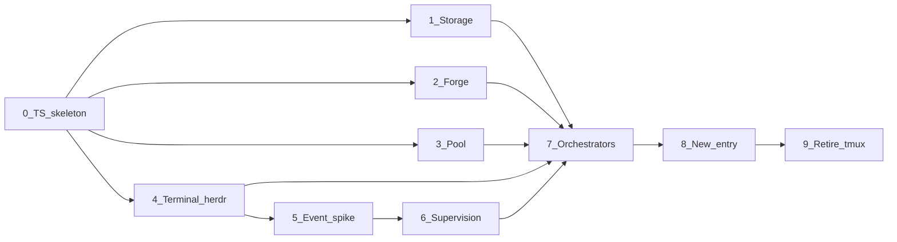

# V2 implementation plan

> Design lives in [`../td/`](../td/INDEX.md). This folder is the delivery cut: what we build first, in which order, and how each slice stays reviewable.

---

## 1. Scope of this cut

**Goal:** the same end-to-end path the MVP proved — create a task, dispatch a shift into a leased worktree, get woken, clock out, open the outbound MR — running on **TypeScript** and **Herdr**, with tmux and bash removed.

| In V2 | Out of V2 (deferred) |
| --- | --- |
| `bin/` ported to TypeScript under `src/`, Commander for the CLI | rewriting `AGENTS.md` / `CLAUDE.md` judgements — they are about `yan <cmd>` and stay as they are |
| Herdr as the only terminal backend; tmux deleted once green | `--remote` Herdr sessions; multi-machine `yan` |
| Supervision rebuilt on Herdr lifecycle states and events | a fourth wake source that polls CI (still deliberately absent) |
| Bare `yan` → select; `attach` removed from the vocabulary | a `yan` dashboard — Herdr already has one ([display.md](../td/display.md)) |
| `yan` keeps the worktree pool; Herdr gets display metadata | `herdr worktree *` as the pool |
| Generated Herdr types + a `yan doctor` protocol check | generated forge types |

**Product sentence for this cut:** *the same task, the same guarantees, in a language the maintainer can maintain, inside the tool the user already lives in.*

---

## 2. Why this can be a strangler and not a rewrite

**`yan` holds no in-memory state.** Every subcommand rebuilds from `task.json`, `run/meta.json`, `log.md`, git, and the forge ([design principle 1](../../mvp/td/INDEX.md#0-what-yan-is)). That was written as a resilience property. It is also, unexpectedly, what makes a per-command port safe: **the interop boundary between the bash half and the TypeScript half is the file system**, and both read it equally well.

So `bin/yan` becomes a dispatcher that prefers a compiled subcommand and falls back to the shell one:

```
yan <cmd>  →  dist/cli/<cmd>.js   if it exists
           →  bin/yan-<cmd>.sh    otherwise
```

One command moves at a time. A half-migrated tree is fully working. There is never a flag day.

The cost is that some libraries exist in both languages for a while — `lib-task.sh` and `store/task.ts` both reading `task.json`. That is real and it is bounded: the duplicate dies the moment its last bash caller is ported. **Duplication is allowed; divergence is not.** If a ported module needs a behaviour change, change it in one place and port the caller in the same phase.

---

## 3. How phases are reviewed

Each phase is **one reviewable unit** — one merge request, one shift, one sitting for `user`.

1. **A phase is done when its Trace bullets pass**, not when the next phase compiles.
2. **Ported tests come with the module they cover.** A phase that moves code without moving its tests is not done. The 58 MVP test scripts are the migration's only real safety net.
3. **Never port a module and change its behaviour in the same commit.** Port, prove green, then change. This is the rule most likely to be broken and the most expensive when it is.
4. **Nothing from [td INDEX §2 "what gets deleted"](../td/INDEX.md#2-what-gets-deleted) is deleted speculatively.** Each deletion is a Trace bullet in the phase that earns it.
5. **Phase 5 is a gate.** No supervision code is deleted before it passes.

---

## 4. Phase map



Phases **1 / 2 / 3 / 4** are independent after 0 and can run in parallel — they are four different seams with no edges between them ([td §4.3](../../mvp/td/architecture.md#43-seams)). Phase 5 is a spike whose result can change Phase 6's design.

| Phase | Name | Review focus |
| --- | --- | --- |
| 0 | TS skeleton & dual dispatch | build, Commander root, utilities, vitest, no behaviour change |
| 1 | Storage & read-only commands | `task.json` / `log.md` in TS; bash and TS agree on disk |
| 2 | Forge seam | 861 lines of JSON mapping, closed return sets, existing fixtures |
| 3 | Pool seam | leases, warm reuse, the orphan guard |
| 4 | Terminal seam on Herdr | the seven functions, generated types, the two-step alive derivation |
| 5 | Event spike (gate) | does `events.subscribe` hold up |
| 6 | Supervision | a socket client, `yan wait` on two sources, reconnect; only the pane hash is deleted |
| 7 | Orchestrators | `shift new/done`, `sync`, `unit`, `session-start`, display metadata |
| 8 | New entry | bare `yan` select, Clack in `src/ui`, `attach` removed |
| 9 | Retire tmux & bash | delete the tmux seam and every remaining `bin/*.sh` but three stubs |

---

## 5. Phases

> **Phases 0–6 have landed, and the module names moved afterwards.** The entries below are the specs those phases were built to, left as written. The paths in them — `src/seams/forge`, `src/seams/pool`, `src/store` — are the old ones. The tree today is `src/externals/{herdr,remote-git,worktree}` and `src/records/{task,shift,log,supervision}`, each a directory with one `index.ts` that is its whole public surface, plus `src/hooks/` for the two Stop hooks the harnesses run.

> Phase 6 briefly gave the event socket a module of its own, `externals/terminal-events`. It was folded into `externals/herdr` straight afterwards: two transports are not two authorities, and keeping them apart meant writing the pane-id shape and the agent-status union twice, with a test whose only job was to police the copies.

### Phase 0 — TS skeleton & dual dispatch

**Delivers:** `tsconfig`, build to `dist/`, vitest, `src/cli/yan.ts` (Commander root, `--help`, `--version`), `src/util/json.ts`, `src/util/git.ts`, the `resolve()` soft/hard helper, `bin/yan` rewritten as the dual dispatcher, the seam-import lint rule.

**Does not deliver:** any subcommand ported.

**Trace**
- Every existing `yan <cmd>` still works, unchanged, through the fallback
- `yan --help` is generated by Commander and lists the same commands
- JSON writes still go `tmp → mv` and every file still carries `version`; `lib-json`'s tests pass against `util/json.ts`
- `util/git.ts` refuses to run without an explicit directory and never uses `--force`
- The lint rule fails a build where one `src/seams/*` imports another
- `jq` is gone from `bin/yan`'s inline dependency check; `node` is there

**td:** [runtime.md §2–3, §5](../td/runtime.md)

---

### Phase 1 — Storage & read-only commands

**Delivers:** `src/store/task.ts`, `src/store/log.ts`; `yan ls`, `yan open`, `yan repo-add`, `yan scope-check`, `yan drain` in TypeScript.

**Trace**
- `history[]` stays append-only; the four current scalars stay separate from it
- `log.ts` cannot rewrite an existing line through its API
- **Interop:** a bash `yan shift new` followed by a TS `yan ls` shows the shift correctly, and the reverse holds
- `yan ls --json` output is byte-identical to the bash version for a fixture task
- `scope-check` reports and never blocks

**td:** [runtime.md §2](../td/runtime.md), [td memory](../../mvp/td/memory.md)

---

### Phase 2 — Forge seam

**Delivers:** `src/seams/forge/` with the four verbs, GitHub and GitLab.

**Trace**
- Callers see only forge vocabulary; no `gh` / `glab` flags leak upward
- `forge_mr_state` ∈ `{merged, closed, open, unknown}`; `forge_ci_state` ∈ `{green, red, pending, none}`
- Every fixture under `tests/fixtures/forge/` replays to the same verdict as the bash implementation
- Whether an MR merged comes from the forge, never from git ancestry
- Bootstrap checks only the CLI named by `forge.kind`

**td:** [td §8.4](../../mvp/td/delivery.md#84-the-forge-layer)

---

### Phase 3 — Pool seam

**Delivers:** `src/seams/pool/`, `yan tree get|return|status`.

**Trace**
- `return` uses `reset --hard` + `clean -fd` and **never** `-x`; gitignored directories survive a round trip
- The orphan-commit guard refuses to return a tree holding uncommitted or unpushed work
- A full pool is backpressure, not silent growth
- Conditional return refuses a mismatched `--if-lease-id` / `--if-lease-holder` before any destructive step
- Path comparison against git's native output still normalises ([conventions §3](conventions.md#3-paths-and-line-endings))

**td:** [td §7](../../mvp/td/worktree.md#7-worktrees)

---

### Phase 4 — Terminal seam on Herdr

**Delivers:** `src/seams/terminal/` — the seven functions on Herdr, `types.ts` generated from `herdr api schema --json`, the type generator, and a `yan doctor` check comparing `protocol` / `schema_version` against the installed binary.

**Does not deliver:** supervision, orchestration, or the deletion of anything tmux.

**Trace**
- `term_container_create` / `term_agent_start` / `term_list` / `term_agent_close` round-trip against a real Herdr session
- `term_agent_start` is two steps — `pane split --no-focus --cwd <path> --env …`, then `agent start … -- <argv>` — and returns only when Herdr reports the agent interactive-ready
- Arguments reach the agent as argv; `--append-system-prompt` with spaces survives ([evidence §2](../td/evidence.md#2-argv-passthrough))
- `term_agent_alive` returns only `alive | dead | unknown`, derived by the two-step in [terminal.md §5](../td/terminal.md#5-alive-dead-unknown); a closed pane is `dead`, a dead Herdr server is `unknown`
- Ids are recorded and used; nothing is located by label; a `pane move` is reconciled by name
- No Herdr `error.code` escapes the seam
- `--no-focus` everywhere; the seam contains no call that can close a workspace, tab, or pane `yan` did not create
- **The assertions of `tests/unit/lib-term-contract.test.sh` are ported to vitest and pass against Herdr.** The bash test keeps running against tmux until Phase 9
- `winpty` appears nowhere
- `yan doctor` reports Herdr's `protocol` / `schema_version` against the generated types, **and** `herdr integration status` for every kind named in `conf/config.json`'s `agents.*` — worded as a version / session-id check, never as "supervision is authoritative" ([terminal.md §6](../td/terminal.md#how-reliable-this-is))
- `agent_session` is recorded when present and its absence is normal, not an error

**td:** [terminal.md](../td/terminal.md), [evidence.md](../td/evidence.md), [sources.md](../td/sources.md)

---

### Phase 5 — Event spike (gate)

**Delivers:** a throwaway spike plus a written answer to the five questions this phase set, recorded as a new section of [`evidence.md`](../td/evidence.md). *(Landed: [evidence §11](../td/evidence.md#11-the-phase-5-event-spike). What it left open became [supervision.md §7](../td/supervision.md#7-what-is-still-open).)*

**Precondition:** both integrations `current` in `herdr integration status` — the configuration `yan` will run in. Note this does **not** buy authoritative state: at v7 the Claude and Codex integrations report session identity only, so `blocked` and `done` are screen matches either way ([sources.md §4.1](../td/sources.md#41-detection-has-two-mechanisms-and-yans-agents-get-the-weaker-one)). Question 3 below is therefore the one that decides how much of supervision survives.

**Trace**
- A subscription survives a multi-hour block; the behaviour when the Herdr server restarts under it is documented
- Events arrive for panes that are not focused, and to a subscriber started from a hook's environment
- **The prompts that matter are enumerated and each is checked** — permission request, plan approval, tool prompt, and whatever else Claude and Codex actually block on — with a written list of which ones Herdr recognises and which it reports as `idle`. This is screen matching for both agents, so a single happy-path observation proves nothing
- The window between dispatch and subscription is measured, and whether a post-subscribe snapshot read is needed is settled
- `agent wait --until` is exercised once, for the single-shift case
- **Whether `pane report-agent --state` suppresses Herdr's own detection** for that pane is measured both ways, and a recommendation is written
- `agent start --kind codex` succeeds when `codex` is not on the caller's `PATH`, or how Herdr resolves the executable is documented

**Gate:** if subscription is unreliable, Phase 6 falls back to polling `agent list` — still on facts rather than a content hash — and the lock and beacon stay. Say which, in writing, before starting Phase 6.

---

### Phase 6 — Supervision

**Delivers:** a socket client for Herdr's event stream, `yan wait` on two sources, `hook-autoarm` and `hook-turnend-guard` as TypeScript behind shell stubs, `.claude/settings.json` and `.codex/hooks.json` updated.

**This phase is not the deletion it was planned as.** `events.subscribe` has no CLI verb, `pane_exited` cannot be subscribed to, and a reconnect path is mandatory — so a named-pipe client and a reconnect loop come in while only the pane-content hash goes out. Roughly a wash on line count, a clear win on signal ([supervision.md §6](../td/supervision.md#6-what-this-actually-costs)). **Delete nothing to hit a number.**

**Trace**
- A socket client speaks `events.subscribe` over the named pipe, with the Windows pipe-name rule, and lives in its own module with its own `index.ts` and its own test
- Two sources: `run/signal` and Herdr events. The pane-content hash is **gone**; the liveness poll is **not**, because `pane_exited` has no push channel
- Subscribe → snapshot each live pane → block. The snapshot is what closes the window for a `yan wait` starting up over shifts that are already running
- A subscription that ends is reconnected and re-subscribed from `run/meta.json`, and takes a snapshot on the way back in. That path is tested by ending the connection under it, not by hoping
- `blocked` → escalate; `done` → wake; `idle` / `working` / `unknown` → not actionable
- **`done` is a reason to look, never a verdict.** Plan approval arrives as `done` ([evidence §11.3](../td/evidence.md#113-which-prompts-herdr-recognises)), so anything that could clock a shift out re-checks the objective condition — the MR merged into the integration branch — first. A test drives a `done` wake on a shift with no merged MR and asserts nothing was torn down
- **`yan` never calls `agent focus` on a shift pane** — a test asserts the string is absent from the seam
- Claude: SessionStart → `yan session-start`; Stop autoarm runs long `yan wait` in the hook foreground, never `&`
- Guard keeps its own count in `run/guard-failures`, budget 3, does not use `stop_hook_active` as a one-shot, fails open loudly, keeps the 800 ms lock-claim wait
- Codex: no autoarm; the model loops `yan wait --seconds N`; quiet end exits 124
- **The beacon is decided, not assumed.** Its retirement argument assumed one blocking read and does not survive a reconnect loop plus a poll. Keep it or drop it, and write down which and why — the same decision settles what "watcher healthy" means when a watcher is legitimately mid-reconnect
- No CI-polling fourth source

**td:** [supervision.md](../td/supervision.md) §2, §3, §6, §7

---

### Phase 7 — Orchestrators

**Delivers:** `yan shift new`, `yan shift done`, `yan sync`, `yan unit add`, `yan unit set`, `yan state`, `yan send`, `yan report`, `yan session-start`, `yan mr`, `yan land`, and the display-metadata calls from [display.md §4](../td/display.md#4-when-each-call-happens).

**Trace** — the four MVP ordering regressions first, because none of them fails loudly:
- `shift new` asserts the sub-agent's cwd is not a main clone and **refuses** otherwise
- `shift done` order: MR merged → `outcome` → `rm -rf run/` → **return the tree** → **then** delete the remote branch
- `sync` exits immediately on conflict and never resolves one
- After `pool_return`, gitignored directories are still there

and then:
- `unit set --branch` archives the old round into `history[]` atomically; `unit add` stops when the `branch-name` hook exits non-zero and never falls back to a default
- `state` derives; it never reads the last line of `run/status` as the current state
- `session-start` rebuilds from disk + Herdr + pool + forge with no durable `yan` state
- Workspace tokens and pane titles are set at the moments in display.md §4, cleared on teardown, and a metadata failure logs one line without aborting the operation
- `target` is never defaulted by any command

**td:** [td agents §5.1–5.4](../../mvp/td/agents.md), [display.md](../td/display.md)

---

### Phase 8 — New entry

**Delivers:** bare `yan` → select; `src/ui/prompts.ts`; `yan continue` without the container half; `yan task new` ending in the current pane; `lib-ui.sh` and `ui/` deleted.

**Trace**
- `yan` with a TTY shows create-new-task plus live tasks, derived from the same scan `yan ls` uses; without a TTY it prints usage and exits 0
- Choosing a task starts the main agent **in the calling pane**; no workspace is created
- A dispatched shift lands in a sibling pane and `user`'s focus does not move
- A second `yan` on the same task is still refused, and `continue` reports where the live one is instead of spawning a duplicate
- No `attach` remains in the code or the docs
- The `ui_node` / nvm discovery dance is gone; Clack is a normal dependency
- Agent-only commands (`report`, `wait`, `drain`, `send`) grew no prompts

**td:** [cli-ux.md](../td/cli-ux.md)

---

### Phase 9 — Retire tmux and bash

**Delivers:** deletion. The tmux implementation, the `backend` config key and its fail-closed branches, every `bin/*.sh` except the three hook/entry stubs, `tests/run.sh`, `tests/assert.sh`, `tests/stub/`, and the `jq` / `winpty` / `tmux` dependency checks.

**Trace**
- `grep -ri tmux bin/ src/` returns nothing but history
- `bin/` contains exactly `yan`, `hook-autoarm.sh`, `hook-turnend-guard.sh`, and each is a few lines
- `yan doctor` lists: git, node, herdr, the forge CLI selected by `forge.kind`. Not `jq`, not `tmux`, not `winpty`
- The full vitest suite is green on Git Bash and on WSL/Linux
- [`conventions.md`](conventions.md), `AGENTS.md`, `CLAUDE.md` and the MVP docs' stale claims are updated in this phase, not left for later

---

## 6. Definition of "V2 done"

1. `herdr` is running; typing `yan` in a pane offers create-or-continue
2. Creating a task ends with the main agent in that pane, no new workspace
3. Dispatching a shift splits a sibling pane into a leased worktree, without moving focus
4. A shift hitting an approval prompt wakes `yan` through Herdr's `blocked`, without the shift reporting anything
5. `shift done` cleans up in the correct order; the outbound MR opens with `yan mr`; `yan land` only when asked
6. Closing `yan` and reopening rebuilds everything; nothing is lost
7. No bash left in `bin/` except three stubs, and no `jq`, `tmux` or `winpty` anywhere

---

## 7. Running this as a `yan` task

One repository, so **one `unit`** ([CLAUDE.md](../../../CLAUDE.md): two directories released together are one unit). `scope` is the whole repository — the repository *is* the unit, which is the legitimate use of an empty scope.

Each phase is one `shift`. `needs` follows the graph in §4, so Phases 1–4 can be dispatched in parallel and `yan land` will order the rest. Phase 5 is the one shift that is a `scout`: it investigates and reports, it does not change code.

The delicate part is Phase 0, because it rewrites the dispatcher every later shift depends on. Land it alone, on its own integration branch round, before dispatching anything in parallel.
