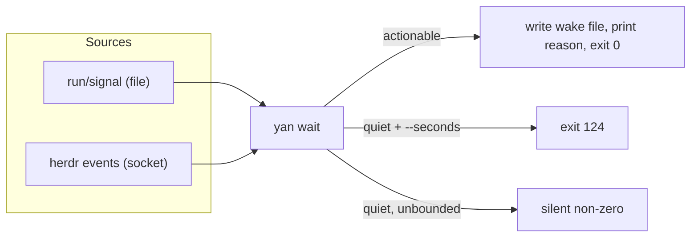

# Supervision, second cut

> This document revises [td §5.5](../../mvp/td/supervision.md#55-supervision). The question it answers is unchanged: *when a `shift` finishes or gets stuck, who wakes `yan` up?* What changes is that one of the three things the MVP had to infer, Herdr reports as a fact.
> The Phase 5 spike has run, and it cost this document its headline: the redesign is **not** the large subtraction it was written as. See [§6](#6-what-this-actually-costs) for the real ledger.
> Phase 6 has since been built. The two things it was left to decide — whether the beacon survives, and what "watcher healthy" means across a reconnect — are settled in [§4](#4-what-survives-from-the-mvp) and [§5](#5-what-the-guard-checks-now); [§7](#7-what-is-still-open) is what remains open after it.

---

## 1. What was inferred, and what is now known

| MVP source | Cost | V2 |
| --- | --- | --- |
| `run/signal` — the shift reporting via `yan report` | a file existence check | **unchanged.** This is `yan`'s own channel and Herdr knows nothing about it |
| `term_agent_alive` — the agent died and cannot say so | one terminal query | **still a poll.** `pane_exited` is not subscribable ([§2](#2-the-shape-of-yan-wait)), so this one did not become an event at all |
| the pane's content hash unchanged for a long time | `term_read` plus `md5` | **deleted.** Herdr reports `blocked` when it recognises an approval or question UI, and `done` when unseen work finishes ([terminal.md §6](terminal.md#6-agent-lifecycle-states)) |

The third row is the point. The hash was a heuristic standing in for "the agent is waiting for a human and hasn't said so" — the failure the MVP itself named as the most common one. Herdr observes that condition directly and from the outside, so it no longer depends on the shift remembering anything.

With one qualification that decides the shape of the rest of this document. **For Claude Code and Codex, Herdr's observation is a screen match, not a hook report.** Their integrations report session identity only and never push state ([sources.md §4.1](sources.md#41-detection-has-two-mechanisms-and-yans-agents-get-the-weaker-one), [evidence §8](evidence.md#8-integration-status)), so state classification falls to the manifest — where *"new agent prompts may initially show as `idle` until manifests learn the UI pattern"*.

That is strictly better than the MVP's content hash: a tuned pattern for a known agent UI beats "these bytes stopped changing". But it is not a fact, it is a good guess, and it can be wrong in the quiet direction. So row one is **not** redundant with row three. They fail in opposite directions — a shift can report a block Herdr did not see, and Herdr can see a block the shift did not report — and keeping both is what makes the pair reliable rather than merely cheaper.

---

## 2. The shape of `yan wait`

`yan wait` survives as a command and as a pure observer holding no durable state. Its two shapes ([supervision §5.5](../../mvp/td/supervision.md#55-supervision)) survive too: unbounded for the Claude Stop autoarm, `--seconds N` for the Codex checkpoint loop. What changes is its inside.



**Two push sources and one poll.** The diagram counts what pushes: a file and a socket. It is not the whole list, and Phase 6 found the difference matters when writing the code — the liveness poll produces a wake reason of its own (`died:`), so it is a *source* in every sense that counts, and `yan wait --sources` names all three:

```
signal          run/signal exists            the shift reported via `yan report`
agent-status    a Herdr subscription         blocked / done, seen from outside
agent-alive     termAgentAlive says dead     the agent died and cannot say so
```

What is gone, and what "two, not three" was really about, is the MVP's **pane-content hash**. The wake file, `yan drain`, the reasons vocabulary, and the exit-code contract are all unchanged, because everything downstream of "something happened" already worked.

**Subscription, not polling — but the transport is not the CLI.** The spike found that `herdr api` has exactly two subcommands, `snapshot` and `schema`: `events.subscribe` exists in the request schema and has **no CLI verb at all**. A subscriber has to speak the socket protocol itself, and on Windows the socket is a named pipe whose name is the `.sock` path ([evidence §11.1](evidence.md#111-there-is-no-cli-for-eventssubscribe-the-transport-is-a-named-pipe)). So the terminal seam's CLI transport does not cover supervision: **`yan wait` needs a second, socket-level client, and that is the first thing Phase 6 builds.**

**Two things a subscription cannot do**, and the design has to live with both:

| wanted | available |
| --- | --- |
| `agent_status → blocked` / `done` / `idle` / `working` | **yes**, `pane.agent_status_changed`, one subscription per pane |
| `pane_exited` → the agent died | **no.** It is in `EventKind` but not in `SubscriptionEventKind`, and `events.wait` refuses it with `unsupported_event_wait_match` |

"The agent died and cannot say so" therefore has **no push channel** and stays a poll of `termAgentAlive`. Row 2 of the table above keeps its fallback because the fallback is all there is.

**Reconnect is not optional.** The spike held one subscription for 420 s but never measured multi-hour, and never tested a server restart — the only way to do that is `herdr server stop`, which kills the user's session. So Phase 6 treats "the subscription ended" as a state it handles rather than one it has seen: reconnect, re-subscribe from `run/meta.json`, and take a snapshot read on the way back in.

**`agent wait` is the degenerate case.** For waiting on exactly one shift, `herdr agent wait <target> --until blocked --until done --timeout <ms>` is a single server-side call over the ordinary CLI and needs no socket client. It is a state check rather than an edge trigger — it returns at once if the status already matches — which is also why a snapshot read after subscribing closes the startup window.

---

## 3. What the events mean to `yan`

The seam translates; `yan wait` decides. The mapping is small enough to state completely:

| Herdr | `yan wait` reason | Why it is actionable |
| --- | --- | --- |
| `agent_status → blocked` | `blocked: <sid>` | the shift is sitting on an approval or a question |
| `agent_status → done` | `done: <sid>` | unseen work finished; `yan` should look — **but see below** |
| `pane_exited` | `died: <sid>` | the agent is gone and could not report |
| `agent_status → idle` | *not actionable* | it was seen; `user` is already looking at it |
| `agent_status → working` | *not actionable* | normal |
| `agent_status → unknown` | *not actionable* | explicitly not a completion signal |

`idle` being non-actionable is deliberate and is the subtle half of the `done` / `idle` split: if the tab has been seen, `user` already knows. This also means **`yan` must never call `agent focus` on a shift's pane**, because focusing marks it seen and converts a `done` it was about to be woken by into an `idle` it will ignore. Reading with `agent read` does not mark it seen. This is a real footgun and belongs in the seam as a comment, not only here.

### `done` does not mean finished

The spike found the plan-approval prompt arriving as **`done`**, not `blocked`: no screen rule matched the box, so Herdr fell back to the terminal title and classified it idle ([evidence §11.3](evidence.md#113-which-prompts-herdr-recognises)).

The wake still happens, which is why the table above calls it actionable. The hazard is what `yan` does next. `done` is also the word for "this shift finished its work", so a shift parked on a plan approval looks like a shift that is ready to clock out — and clocking out is destructive: it deletes `run/`, returns the tree, deletes the branch.

**So `done` is a reason to look, never a verdict.** Rule 3 already says the only clock-out condition is the merge request having merged into the integration branch, and that is the objective check `done` must fall back to. This is not new policy; it is the existing rule, restated here because this is where it would be forgotten.

---

## 4. What survives from the MVP

Not everything goes. Kept, for the reasons the MVP gave:

- **`run/signal` and `yan report`.** A shift's own five-state report says things Herdr cannot see — `blocked` on a *decision about the work*, as opposed to a UI dialog — and it is also the cover for Herdr's false negatives ([§1](#1-what-was-inferred-and-what-is-now-known)). This channel is not a legacy leftover; deleting it would make supervision strictly worse than the MVP's.
- **The single-flight lock**, in a reduced form: under Claude every Stop can fire autoarm, so without it several watchers start. Node's atomic file creation replaces the `mkdir` scheme from [conventions §2.2](../../mvp/plan/conventions.md).
- **The wake file.** The reason must survive from "wait exited" to "the model's next turn".
- **Both harness bindings, unchanged.** Claude autoarm plus turn-end guard; Codex checkpoint loop plus guard. Herdr is the multiplexer axis; the harness is a different axis, and [td §5.6 / §5.7](../../mvp/td/agents.md#56-harness-requirements) keeps them apart.
- **The known gap.** After every shift has clocked out and outbound CI is running, there is still nothing to wait for. `yan wait` still does not poll CI. Unchanged, and still deliberate.

**The beacon: KEPT. Decided in Phase 6, with the reconnect path built.**

It was going to go because "a subscriber blocked on a socket either holds the connection or does not, and the guard can ask that directly". That reasoning assumed one blocking read. What Phase 6 actually built is a subscription that can end and reconnect, **plus** a poll for liveness, because `pane_exited` cannot be subscribed to. "Is the watcher still going round?" is a real question again, which is exactly what the beacon answered.

Three things had to be true for it to go, and none of them is:

| the retirement argument needed | what Phase 6 found |
| --- | --- |
| one blocking read, so "connected" ≡ "watching" | a loop: subscribe, snapshot, poll, reconnect. A watcher can be disconnected and perfectly healthy |
| the connection observable from another process | on Windows it is a named pipe held by the watcher. The guard is a different process and cannot see it at all |
| the lock to imply attendance | a process that stopped looping still holds its lock. A pid is not attendance — the MVP's original reason, unchanged |

So the beacon stays, and **the price is stated rather than discovered**: it reintroduces a freshness window, which means a guard can call a live watcher unhealthy if the loop legitimately takes longer than `YAN_WATCH_BEACON_MAX` (300 s) to come round. That is survivable because the loop's period is the poll interval (5 s by default) and because the guard fails open after three attempts; it would stop being survivable if any wait source ever became a long blocking call without touching the beacon first. **A watcher that blocks must touch the beacon before it blocks.**

**What the beacon attests to changed, and that is the substantive half of the decision.** It is written by the SUPERVISION LOOP, not by the subscription — every turn of the loop touches it, including the turns spent reconnecting. It says "this watcher went round recently", never "this watcher is subscribed". `run/beacon` carries a fourth field naming the loop's state (`subscribed` / `reconnecting` / `polling`) for a human reading it; **no predicate branches on that field.**

---

## 5. What the guard checks now

"Watcher healthy" was: the lock exists, its pid is alive, the identity matches, and the beacon is fresh.

**All four are unchanged, and Phase 6 settled the fourth: a watcher that is mid-reconnect is HEALTHY.**

The question was whether "holds a live subscription" should join the list. It should not, and the reasoning is the same one that kept the beacon:

1. **A reconnect gap is the design working, not failing.** The subscription is expected to end — the spike never got to watch a Herdr restart happen under one ([evidence §11.4](evidence.md#114-a-subscription-survives-and-reaches-a-hooks-environment)), so `yan wait` treats "it ended" as a state it handles. A guard that blocked a turn for the seconds a reconnect takes would be inventing a fault out of the recovery path.
2. **The watcher is not blind during the gap.** `run/signal` never went through the socket, and neither did the liveness poll — which is the source that has no push channel at all. What a disconnected watcher loses is `blocked` / `done` arriving *promptly*; the snapshot taken on the way back in recovers them, one loop late.
3. **The guard could not ask the question anyway.** The subscription is a socket the watcher holds; on Windows a named pipe. There is no file, no lock field and no API by which another process could check it, so "holds a live subscription" would have to be self-reported through a file — which is a beacon with a worse name.

So the test is **"went round recently"**, which is exactly what a loop-written beacon answers, and the guard has no notion of subscription state at all. What is still unhealthy is unchanged: no lock, a dead owner, a foreign identity, a stale beacon, or a beacon and a lock belonging to different processes.

The Claude guard's other rules do not change and are still the parts most likely to be got wrong on a rewrite: it keeps its own count in `run/guard-failures`, it does **not** use `stop_hook_active` as a one-shot unblock, its budget is 3, and it fails open with a loud warning rather than wedging the session. The 800 ms wait that stops the guard false-alarming while autoarm is still claiming the lock stays.

---

## 6. What this actually costs

The Phase 5 spike has run ([evidence §11](evidence.md#11-the-phase-5-event-spike)). This section replaces the estimate that stood here before, which was wrong in the direction estimates usually are.

**The claim was ~700 lines deleted. It is not.** Here is the real ledger:

| | MVP | V2 |
| --- | --- | --- |
| pane-content hash | `lib-watch.sh`'s hashing | **deleted** |
| poll loop for liveness | yes | **still needed** — `pane_exited` cannot be subscribed to |
| single-flight lock | `lib-lock.sh`, 221 lines of `mkdir` scheme | kept, on `fs.open(…, 'wx')`, much smaller |
| beacon | yes | **kept**, and now attests to the loop rather than the connection ([§4](#4-what-survives-from-the-mvp)) |
| `run/signal` watch | yes | kept |
| named-pipe JSON-RPC client | — | **new**, and Windows needs the pipe-name rule |
| reconnect / re-subscribe / snapshot | — | **new**, and mandatory ([§2](#2-the-shape-of-yan-wait)) |

Roughly a wash on line count. **The gain is not size, it is signal quality**: `blocked` is a semantic state that Herdr observes from outside, where the MVP had "these bytes stopped changing". That is worth doing on its own, and no phase should delete anything to chase a number that was never real.

Two consequences for how Phase 6 is judged:

1. **Nothing is deleted to hit a target.** `lib-watch.sh`'s polling goes when the reconnect path is proven, and not before.
2. **The subtraction framing in [td INDEX §2](INDEX.md#2-what-gets-deleted) is corrected there too.** V2 is still mostly subtraction; supervision is the one place it is not.

## 7. What is still open

The spike answered its five questions and left three things for Phase 6. Item 2 is now decided; items 1 and 3 are not the kind of thing an implementation can close.

1. **Multi-hour subscriptions, and server restart.** 420 s was measured; the autoarm case is hours. Restart was never tested — `herdr server stop` kills the user's session. Phase 6 handled it as a state rather than waiting to observe it: `yan wait` reconnects, re-subscribes from `run/meta.json`, and snapshots on the way back in, and its test ends the connection under it rather than hoping. **Still open** is the wall-clock claim itself — nothing yet has held a subscription for hours, and the first long autoarm run is the measurement.
2. **The beacon, and what "watcher healthy" means** — **decided**: both kept, both defined against the loop rather than the connection ([§4](#4-what-survives-from-the-mvp), [§5](#5-what-the-guard-checks-now)).
3. **Plan approval arrives as `done`** ([§3](#done-does-not-mean-finished)). Whether more of Claude's and Codex's prompts miss is a manifest question, not a yan one — but `run/signal` is what covers the gap, and that is why it is not going anywhere.

And one thing Phase 6 opened that was not on the list: **what a watcher does when the socket is not there at all.** `yan wait` degrades to polling `agent list` for status — the same facts, one loop late, which is the fallback the Phase 5 gate named — and says so once on stderr. That is deliberately not silent: a watcher running blind to `blocked` is a thing `user` should be able to see in the transcript.
