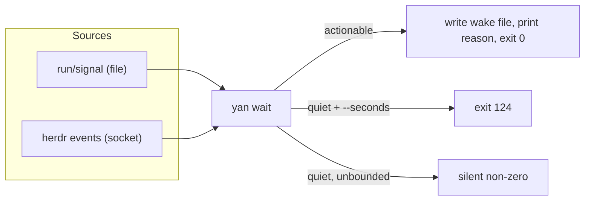

# Supervision, second cut

> This document revises [td §5.5](../../mvp/td/supervision.md#55-supervision). The question it answers is unchanged: *when a `shift` finishes or gets stuck, who wakes `yan` up?* The answer gets much smaller, because two of the three things the MVP had to infer, Herdr reports as facts.
> This is the largest subtraction in V2 and it rests on a capability that is **read from the API schema but not yet exercised**. See [§6](#6-what-must-be-proven-first).

---

## 1. What was inferred, and what is now known

| MVP source | Cost | V2 |
| --- | --- | --- |
| `run/signal` — the shift reporting via `yan report` | a file existence check | **unchanged.** This is `yan`'s own channel and Herdr knows nothing about it |
| `term_agent_alive` — the agent died and cannot say so | one terminal query | **event.** `pane_exited` / `pane_agent_status_changed`; polling remains as the fallback |
| the pane's content hash unchanged for a long time | `term_read` plus `md5` | **deleted.** Herdr reports `blocked` when it recognises an approval or question UI, and `done` when unseen work finishes ([terminal.md §6](terminal.md#6-agent-lifecycle-states)) |

The third row is the point. The hash was a heuristic standing in for "the agent is waiting for a human and hasn't said so" — the failure the MVP itself named as the most common one. Herdr observes that condition directly and from the outside, so it no longer depends on the shift remembering anything.

With one qualification that decides the shape of the rest of this document. **For Claude Code and Codex, Herdr's observation is a screen match, not a hook report.** Their integrations report session identity only and never push state ([sources.md §4.1](sources.md#41-detection-has-two-mechanisms-and-yans-agents-get-the-weaker-one), [evidence §8](evidence.md#8-integration-status)), so state classification falls to the manifest — where *"new agent prompts may initially show as `idle` until manifests learn the UI pattern"*.

That is strictly better than the MVP's content hash: a tuned pattern for a known agent UI beats "these bytes stopped changing". But it is not a fact, it is a good guess, and it can be wrong in the quiet direction. So row one is **not** redundant with row three. They fail in opposite directions — a shift can report a block Herdr did not see, and Herdr can see a block the shift did not report — and keeping both is what makes the pair reliable rather than merely cheaper.

---

## 2. The shape of `yan wait`

`yan wait` survives as a command and as a pure observer holding no durable state. Its two shapes ([supervision §5.5](../../mvp/td/supervision.md#55-supervision)) survive too: unbounded for the Claude Stop autoarm, `--seconds N` for the Codex checkpoint loop. What changes is its inside.

Two sources, not three. The wake file, `yan drain`, the reasons vocabulary, and the exit-code contract are all unchanged, because everything downstream of "something happened" already worked.

**Subscription, not polling.** The API exposes `events.subscribe` with `SubscriptionEventKind ∈ {pane.output_matched, pane.agent_status_changed, pane.scroll_changed}`, and a broader `EventKind` of 26 including `pane_exited`, `pane_agent_detected` and `pane_agent_status_changed`. `yan wait` subscribes to the panes recorded in the live shifts' `run/meta.json` and blocks on the stream, with `run/signal` watched alongside.

**`agent wait` is the degenerate case.** For waiting on exactly one shift, `herdr agent wait <target> --until blocked --until done --timeout <ms>` is a single server-side call and needs no subscription at all. `yan wait` uses it when there is one live shift and the event stream when there are several.

---

## 3. What the events mean to `yan`

The seam translates; `yan wait` decides. The mapping is small enough to state completely:

| Herdr | `yan wait` reason | Why it is actionable |
| --- | --- | --- |
| `agent_status → blocked` | `blocked: <sid>` | the shift is sitting on an approval or a question |
| `agent_status → done` | `done: <sid>` | unseen work finished; `yan` should look |
| `pane_exited` | `died: <sid>` | the agent is gone and could not report |
| `agent_status → idle` | *not actionable* | it was seen; `user` is already looking at it |
| `agent_status → working` | *not actionable* | normal |
| `agent_status → unknown` | *not actionable* | explicitly not a completion signal |

`idle` being non-actionable is deliberate and is the subtle half of the `done` / `idle` split: if the tab has been seen, `user` already knows. This also means **`yan` must never call `agent focus` on a shift's pane**, because focusing marks it seen and converts a `done` it was about to be woken by into an `idle` it will ignore. Reading with `agent read` does not mark it seen. This is a real footgun and belongs in the seam as a comment, not only here.

---

## 4. What survives from the MVP

Not everything goes. Kept, for the reasons the MVP gave:

- **`run/signal` and `yan report`.** A shift's own five-state report says things Herdr cannot see — `blocked` on a *decision about the work*, as opposed to a UI dialog — and it is also the cover for Herdr's false negatives ([§1](#1-what-was-inferred-and-what-is-now-known)). This channel is not a legacy leftover; deleting it would make supervision strictly worse than the MVP's.
- **The single-flight lock**, in a reduced form: under Claude every Stop can fire autoarm, so without it several watchers start. Node's atomic file creation replaces the `mkdir` scheme from [conventions §2.2](../../mvp/plan/conventions.md).
- **The wake file.** The reason must survive from "wait exited" to "the model's next turn".
- **Both harness bindings, unchanged.** Claude autoarm plus turn-end guard; Codex checkpoint loop plus guard. Herdr is the multiplexer axis; the harness is a different axis, and [td §5.6 / §5.7](../../mvp/td/agents.md#56-harness-requirements) keeps them apart.
- **The known gap.** After every shift has clocked out and outbound CI is running, there is still nothing to wait for. `yan wait` still does not poll CI. Unchanged, and still deliberate.

**The beacon is retired.** It existed to prove a watcher was still looping rather than merely alive, which was a real question for a bash polling loop. A subscriber blocked on a socket either holds the connection or does not, and the guard can ask that directly. Retiring it removes the whole freshness-window class of bug — a stale beacon blocking a live watcher, a fresh leftover beacon blocking a missing one.

---

## 5. What the guard checks now

"Watcher healthy" was: the lock exists, its pid is alive, the identity matches, and the beacon is fresh. It becomes: **the lock exists, its pid is alive, the identity matches, and that process holds a live Herdr subscription.**

The Claude guard's other rules do not change and are still the parts most likely to be got wrong on a rewrite: it keeps its own count in `run/guard-failures`, it does **not** use `stop_hook_active` as a one-shot unblock, its budget is 3, and it fails open with a loud warning rather than wedging the session. The 800 ms wait that stops the guard false-alarming while autoarm is still claiming the lock stays.

---

## 6. What must be proven first

The subtraction above is worth roughly 700 lines, and it rests on one thing that has **not** been exercised: `events.subscribe` was read out of `herdr api schema --json`, not run. Also unexercised: `agent wait --until`, and any Herdr behaviour under Codex.

**Therefore the plan spikes this before committing to it** ([`../plan/INDEX.md`](../plan/INDEX.md) Phase 5).

**Precondition.** `herdr integration install claude` and `… codex` must both report `current` in `herdr integration status`. This does **not** make state authoritative — at v7 those integrations only report session identity ([sources.md §4.1](sources.md#41-detection-has-two-mechanisms-and-yans-agents-get-the-weaker-one)) — but it is the configuration `yan` will actually run in, and the session id is part of what the spike records.

The spike must answer:

1. Does a subscription survive a long block, and what happens when the Herdr server restarts under it?
2. Are events delivered to a subscriber whose pane is not focused, and to one started from a hook's environment?
3. **The critical one.** Does `blocked` actually fire for the approval prompts Claude and Codex show in practice — permission requests, plan approval, a tool prompt, a `/`-menu — or only for some of them? Since this is screen matching for both agents, enumerate the prompts that matter and check each. The answer sizes how much `run/signal` is carrying.
4. What is missed between "shift dispatched" and "subscription established"? A snapshot read after subscribing closes that window; confirm it is needed. Note that `agent wait` *"returns immediately if its status already matches"* ([`/docs/agent-automation/`](https://herdr.dev/docs/agent-automation/)), so it is a state check rather than an edge trigger — the subscription may not be.
5. **Should `yan` report state itself?** `pane report-agent --state` is public and `pane release-agent` releases *"pane agent lifecycle authority"*, so reporting appears to claim it. Measure both ways: does a `yan`-reported state suppress Herdr's own detection for that pane? If it does, reporting only at `yan report` moments would be a downgrade, and the answer is to leave detection alone ([terminal.md §6](terminal.md#how-reliable-this-is)).

If the answer to (1) or (2) is bad, the fallback is a polling loop over `agent list`, which is still strictly better than the MVP because the states are facts rather than a content hash — the beacon and the lock would then come back. **Nothing in the MVP's supervision code may be deleted before this spike passes.**
